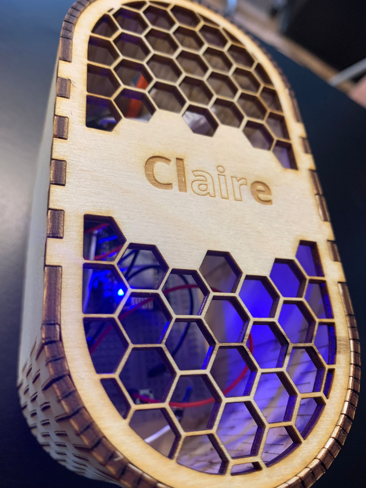

## Situatie
Voor het project was er een behuizing nodig om alle kabels en electronica (sensoren) te kunnen plaatsen.

## Taak
Een behuizing ontwerpen en maken waar alle electronica beschermd blijft.

## Actie

Een behuizing voor Claire moest worden ontworpen om alle bedrading en gevoelige electronica te kunnen beschermen.
Eerst werden de electronica gemeten om rekening mee te houden hoe groot deze moest zijn.
Via www.makercase.com werd een ontwerp gemaakt voor de casing waar alles erin paste.

Vervolgens na lang onderzoeken welke vorm het beste is voor de behuizing, is er voor een hexagon vorm aan de bovenkant gekozen.
De reden hiervoor was omdat de sensoren zeer gevoelig zijn en een opening nodig hadden om de juiste waarden te kunnen meten en waarborgen.

De inspiratie komt uit de natuur, uit een afbeelding van een honingraat. 
Het bestaat uit kleine zeshoeken (hexagon). De zeshoekige cellen symboliseren de uniformiteit, organisatie, orde en eenheid van de bijenkorf.
Deze passen zo mooi bij elkaar en het was een perfecte structuur om de lucht toe te kunnen laten in de behuizing.

## Resultaat
Hier onder is te zien hoe de behuizing uiteindelijk is geworden.

## Reflectie
Het maken van de behuizing was op het laatst gedaan waardoor het alles heel snel en beetje slordig ging.
Helaas was dit vanwege gebrek aan tijd en omdat wij dit onderdeel van het proces erg onderschat hadden.
Als team hebben wij geleerd om hiermee eerder aan te beginnen en alle onderdelen van het proces hoe klein het ook lijkt, niet te onderschatten.
Uiteindelijk zijn wij toch wel blij met het resultaat, alleen het had beter kunnen verlopen.
