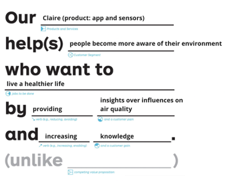
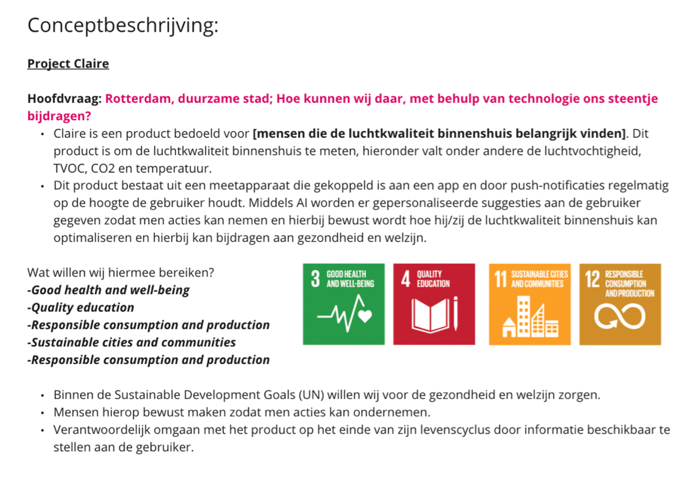
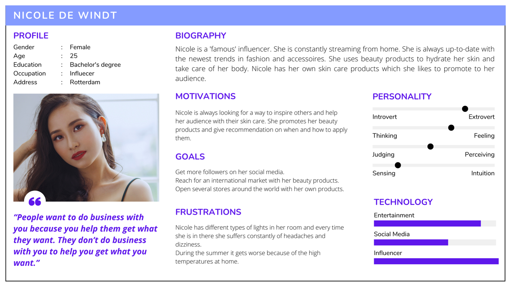
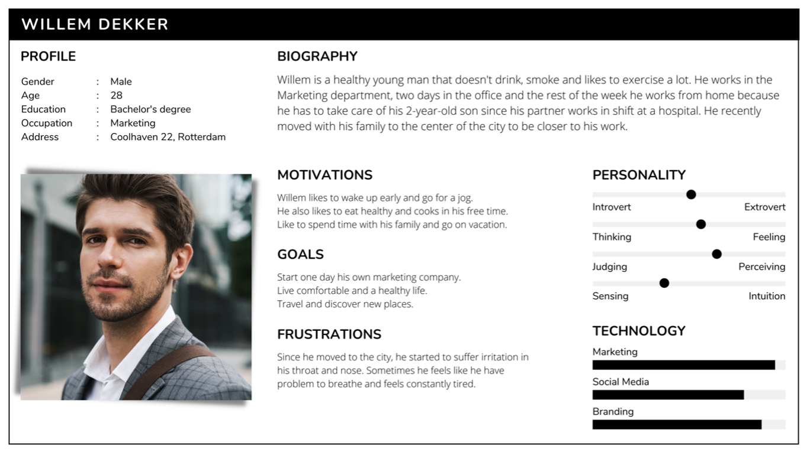
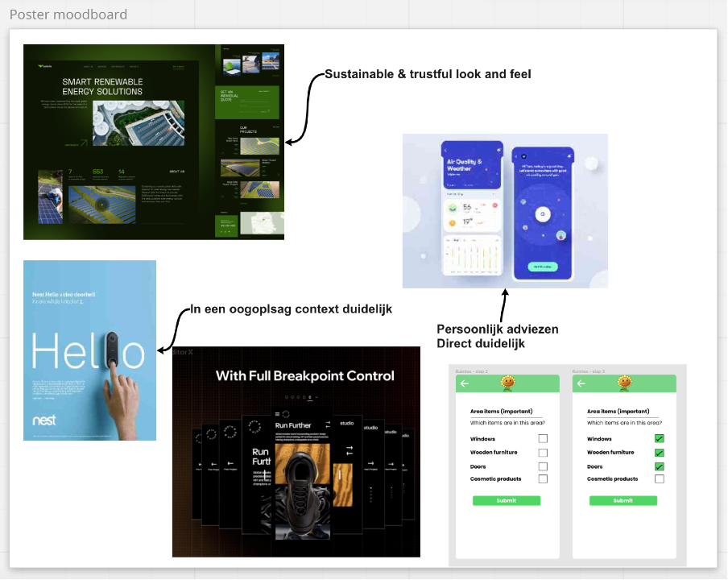

## Situatie
Na een hele lang tijd te hebben gebrainstormd zijn wij uiteindelijk tot het Claire project gekomen.
Uit de interviews van vorige periode bleek dat onze beoogde doelgroep niet overeenkwam met onze aannames en onderzoek. 
Waardoor wij deze moesten aanscherpen. 

## Taak
De doelgroep beter in kaart brengen.

## Actie
Het team heeft meer deskresearch gedaan, aan verschillende mensen in de omgeving van 
Rotterdam vragen gesteld en kwam tot nieuwe inzichten.

Hoe hebben wij dit opgepakt? Eerst werd er een conceptbeschrijving gemaakt om alle inzichten duidelijk 
te maken voor het team en later werden er twee persona gemaakt om een beter beeld te krijgen van de doelgroep. 
Rotterdam voert al jaren een beleid op het verbeteren van de luchtkwaliteit en 
uit ons onderzoek zijn wij erachter gekomen hoe slecht de luchtkwaliteit binnenshuis is voor de gezondheid van de mens. 
Daarom vonden wij het belangrijk om mensen bewust hiervan te maken om op een gezond leven te kunnen leven.

Voor de ontwerpkeuzes binnen de app werd een moodboard opgesteld om duidelijk aan te geven wat voor “look & feel” 
de Claire app zou moeten hebben gebaseerd op het thema duurzaamheid.

## Resultaat
Uit de nieuwe inzichten kwam het team tot de conclusie dat onze doelgroep mensen zijn die bezorgd zijn 
over hun luchtkwaliteit binnenshuis. Door het maken van een conceptbeschrijving werd hierin duidelijker aangegeven 
wat wij met ons project willen bereiken en het doel van ons project. 
Ook staat hierin hoe ons project gekoppeld is aan de Sustainable Development Goals.

## Reflectie
In vergelijking tot vorige periode werd de verzamelde informatie en inzichten niet op een duidelijke manier verwerkt 
waardoor het vaak verwarring bracht in het team. Ook was er binnen ons team geen “ontwerpende technoloog” en 
moesten wij telkens deze taken verdelen. Toch zijn er teamleden die deze taken vaker gingen oppakken wanneer de tijd er toe stond. 
Bij eerdere feedback was het niet duidelijk genoeg hoe ons project een oplossing was 
voor het vraagstuk “Rotterdam een duurzame stad” maar na ons concept beter te formuleren en aan de hand van ons onderzoek 
kunnen wij aantonen hoe belangrijk dit is binnen Rotterdam. Ondanks de situatie, 
heeft het team een concretere doelgroep kunnen vaststellen en verder aan de slag kunnen gaan. 
Het team is meer bewust geworden over hoe belangrijk het is om meer concrete en kleinere taken te maken om het overzicht niet kwijt te raken. 
En als laatst voor toekomstige projecten, is het van belang om duidelijk te zijn welke communicatiemiddelen worden gebruikt, 
omdat er meerdere kanalen waren, was het verwarrend voor het team en zat het team vaker niet op dezelfde lijn.
