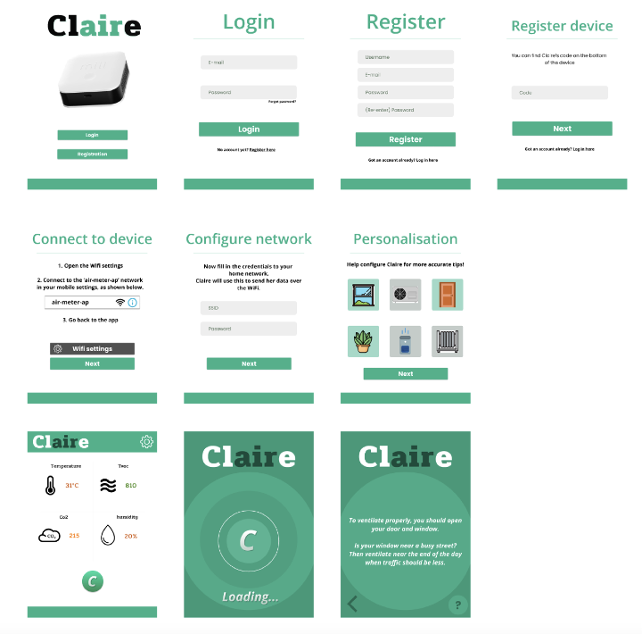
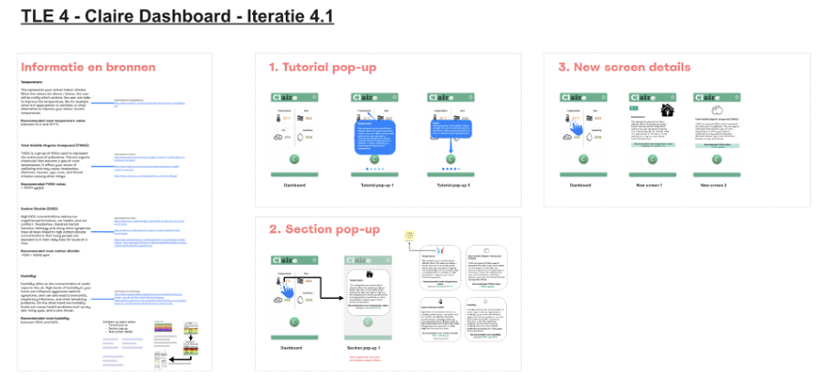
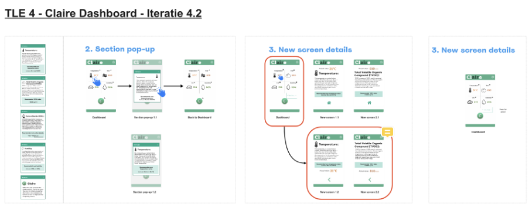
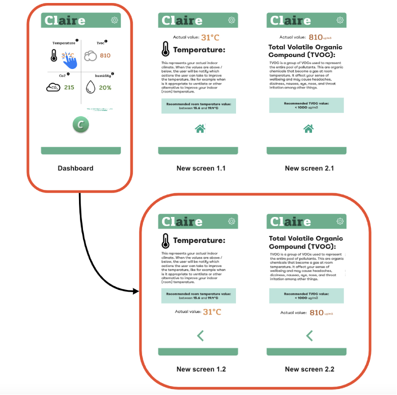
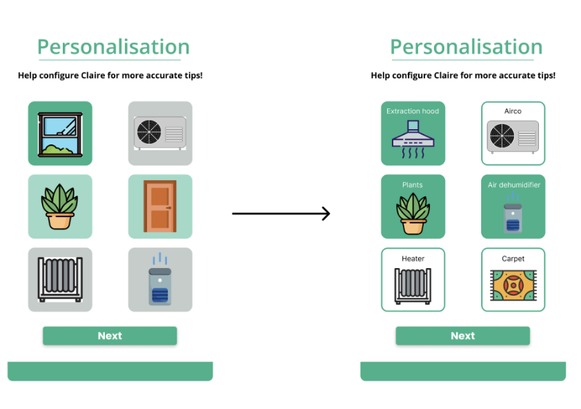

## Situatie
Begin TLE 4 heeft het team de eerste versie van het MVP afgemaakt. Deze is daarna getest met een aantal testpersonen. 
Hieruit bleek dat er een aantal punten niet duidelijk waren wat betreft de interface van de applicatie.

## Taak
Het interface duidelijker maken voor de gebruikers/ testpersonen.
Er was over het algemeen behoefte aan meer informatie.
De volgende punten zijn uit de tests onduidelijk voor de gebruiker gebleken:
* Het dashboard is onduidelijk
* Moeite met resultaten uitlezen
* Behoefte aan extra uitleg (betekenis van de namen en metingen)

## Actie
Bij TLE 3 kreeg het team de feedback om de interface in iteraties uit te werken. (Zie afbeelding hieronder).

Op het moment van testen zag de interface zo uit (zie de volgende afbeelding hieronder):

Omdat de interface niet duidelijk genoeg was is er een 4e iteratie gemaakt van de interface, 
zowel voor het dashboard als de iconen op personalisatie pagina.

## Resultaat
De punten die tijdens de testen zijn uitgekomen zijn verwerkt. 
Nu is er bij het dashboard wat extra toelichting over wat de gemeten waarden betekenen en een overzicht over wat de huidige 
waarden zijn ten opzichte van de gewenste waarden.

In de personalisatie pagina zijn er een aantal afbeeldingen aangepast. Ook staat
er nu onder de afbeeldingen wat het moet voorstellen.

## Reflectie
Na het testen en het verwerken van de observaties en inzichten hebben we een aantal
punten vast kunnen stellen waarop we moeten itereren.
Onder andere meer duidelijkheid voor de gebruiker wat betreft de informatie die werd gegeven. 
Tijdens het ontwerpen van de iteraties dacht elk individu in het team een duidelijk beeld
Naar ons gevoel was de informatie in de app duidelijk, maar dit was niet het geval.
Gelukkig konden wij dit uit de test halen. 
Tijdens het ontwerpproces is er ook onderzoek gedaan naar verschillende applicaties om andere perspectieven te krijgen 
over hoe je de interface gebruiksvriendelijk maakt voor de doelgroep. Het team is bewust van hoe 
belangrijk het is om zo veel mogelijk te testen na het maken van een prototype, 
maar na onze laatste iteratie hadden we niet genoeg tijd om nog een keer te testen. Daarom heeft het team bewust ervoor 
gekozen om onze planning aan te scherpen en de punten op te pakken waar het nog wel mogelijk was om op te itereren.