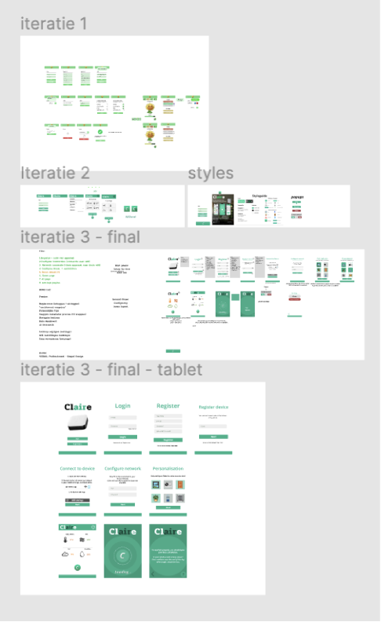

## Situatie
Begin TLE 4 heeft het team de eerste versie van de MVP afgemaakt. Deze werd daarna getest met een aantal testpersonen. 
Hieruit bleek dat er een aantal punten niet duidelijk waren wat betreft de interface van de applicatie.

## Taak
Het interface duidelijker maken voor de gebruikers/ testpersonen.
En er was behoefte van meer informatie over het algemeen.
Punten die onduidelijk waren onder andere:
* Dashboard was onduidelijk
* Moeite met resultaten aflezen
* Behoefte aan extra uitleg (betekenis van de namen en metingen, etc.).

## Actie
Bij TLE 3 kreeg het team de feedback om bij de interface in iteraties uit te werken. (Zie afbeelding hieronder).

Op het moment van testen zag de interface zo uit (zie de volgende afbeelding hieronder):

Omdat de interface niet duidelijk genoeg was, werd er een 4e iteratie gemaakt in de interface, 
zowel voor de dashboard als de iconen (personalisatie pagina).

## Resultaat
De punten die tijdens de testen zijn uitgekomen zijn verwerkt. 
Nu is er bij het dashboard wat extra toelichting van wat het allemaal betekent en een overzicht wat de huidige 
waarden zijn ten opzichte van de gewenste waarden.

Ook bij het personalisatie pagina zijn er meerdere afbeeldingen aangegeven 
maar ook duidelijker gemaakt wat de afbeeldingen zijn.

## Reflectie
Na het testen en het verwerken van de observaties en inzichten, waren duidelijke punten opgevallen die geïtereerd moesten worden. 
Onder andere meer duidelijkheid voor de gebruiker wat betreft de informatie die werd gegeven. 
Tijdens het ontwerpen leekt het erg duidelijk te zijn binnen het team en achteraf bleek het dat onze aannames niet compleet goed waren. 
Gelukkig konden wij dit uit de test halen en onze aannames valideren of het klopte of niet. 
Tijdens het ontwerpproces is er ook onderzoek gedaan naar verschillende applicaties om andere perspectieven te krijgen 
over hun interfaces om het zo gebruikersvriendelijk te maken voor onze doelgroep. Het team is bewust van hoe 
belangrijk het is om zo veel mogelijk te testen na het maken van een prototype, alleen helaas hadden wij niet 
veel meer tijd over om onze nieuwe iteratie te kunnen testen. Hierdoor heeft het team bewust ervoor 
gekozen om onze planning aan te scherpen en de punten op te pakken die wel nog mogelijk was om deze iteratie te kunnen maken.