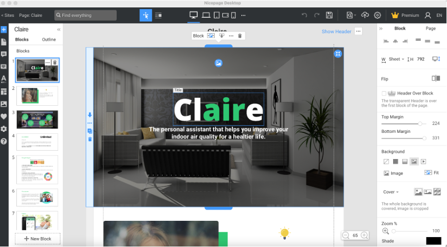
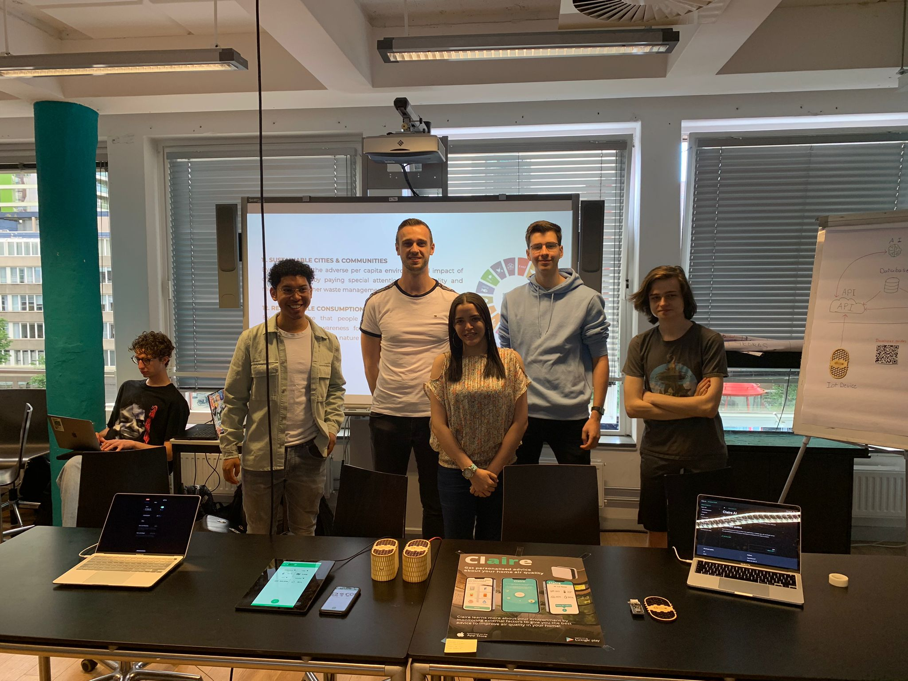
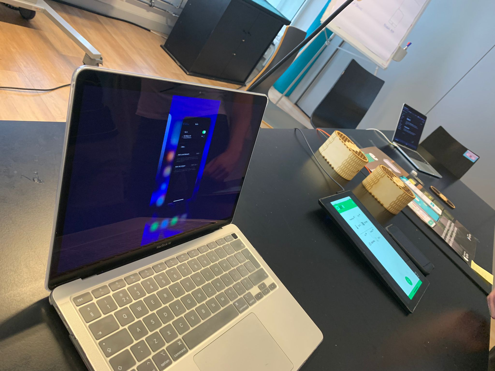
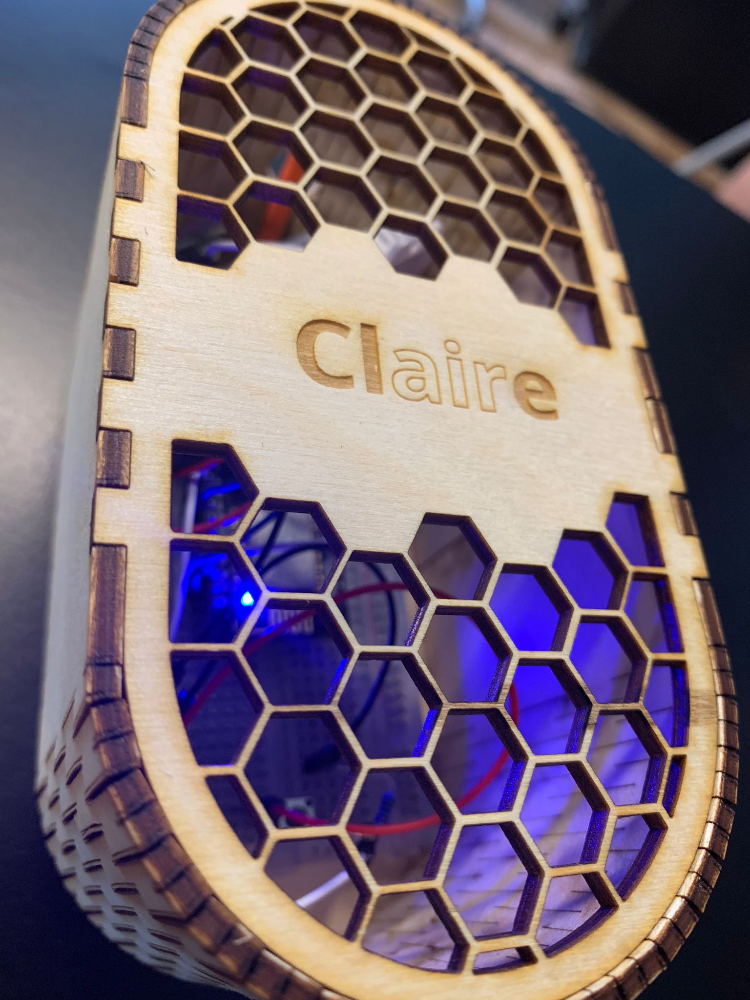
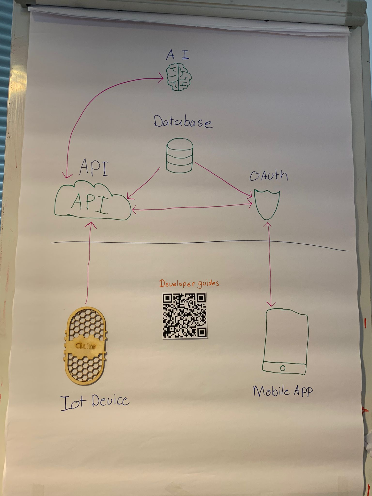
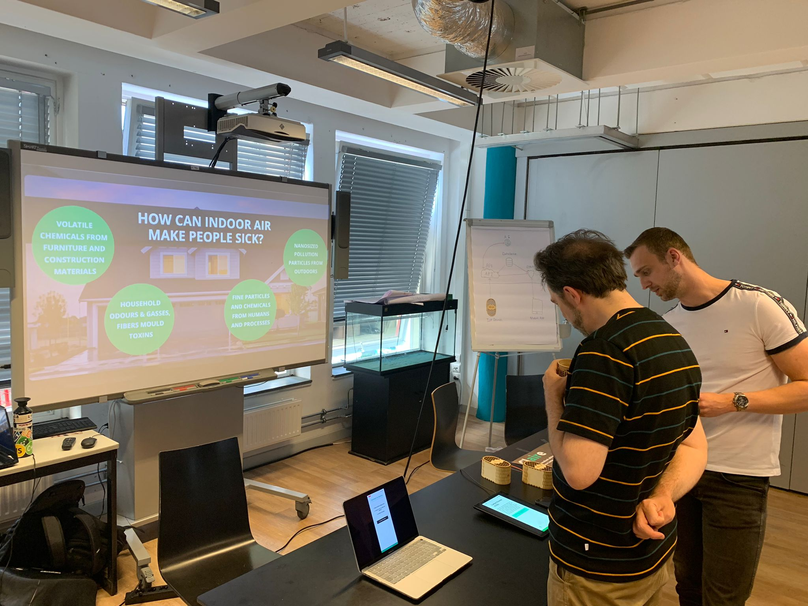
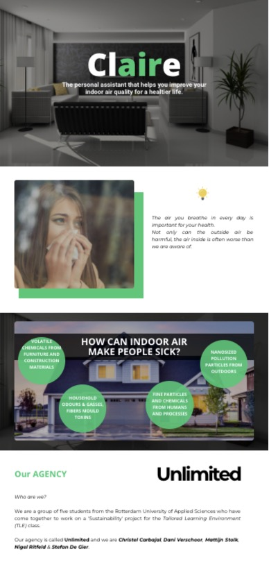
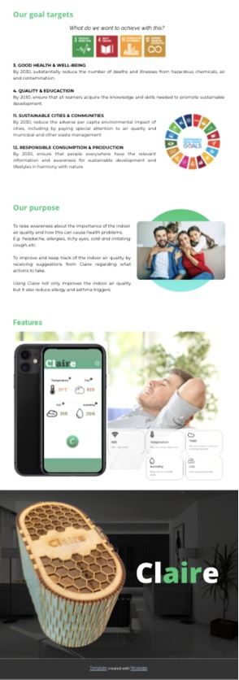

## Situatie
Aan het einde van TLE 4 vindt een eindmarkt plaats waar een demo van het MVP wordt gepresenteerd. Voor het afronden van het project, is het belangrijk om aan de "marketing" van het product te werken. 

## Taak
Uitzoeken op welke manier het beste het prototype gepresenteerd kan worden. 

## Actie
Voor de eindmarkt is er binnen het team besproken om ons project middels een one-pager te presenteren.
Om de informatie toegankelijk te maken over “Wie zijn wij?”, “Wat doet ons product?”, “Wat willen wij hiermee bereiken?”, 
vonden wij het een goed idee om het op deze manier duidelijk te laten zien.

Er zijn verschillende methoden om de one-pager te maken overwogen:
* Handmatig te programmeren (in HTML/CSS/JS)
* Een Powerpoint
* Bestaande templates van one-pager gebruiken

Om de one-pager op tijd af te kunnen krijgen is er voor een template van <i>NICE-software</i> gekozen.

Er is een video gemaakt van de one-pager om deze tijdens de eindmarkt weer te geven
om de aandacht van het publiek te trekken. Deze video wordt geloopt.

## Resultaat

Het resultaat is functioneel product dat bijdraagt aan de maatsschappij.

Wie zijn wij?

Onze promotiematerialen

Claire IoT apparaat

Uitleg van hoe de backend is gevormd met in het midden een QR code die linkt naar onze documentatie.

Het hele plaatje (aan het begin)

De one-pager is hieronder te zien, maar ook via dit link:
https://www.youtube.com/watch?v=ay80LNQgW2c

## Reflectie

Tijdens de eindmarkt konden hebben ons “nieuwe” interface laten zien, hier hebben we positieve feedback op gekregen.
Hierdoor kon het team valideren of de nieuwe iteratie (interface) wat meer duidelijkheid gaf aan de gebruikers.
Dit was geen officiële test maar daardoor konden wij observeren of het betere acceptatie had door het publiek.
Als team zijn wij trots op het eindresultaat, echter zijn wij niet tevreden over hoe het proces liep. 
Dit was omdat wij aan het begin veel tijd hebben verloren, en wij konden die tijd beter benutten. 
Wel zijn wij bewust dat dit deel uit maakt van het proces en dat wij hiervan hebben geleerd. 
Voor de toekomst is het dus van belang om meer concrete keuzes te maken en meer betrokken worden bij de doelgroep. 
Uiteindelijk maken wij het product voor de doelgroep. 
