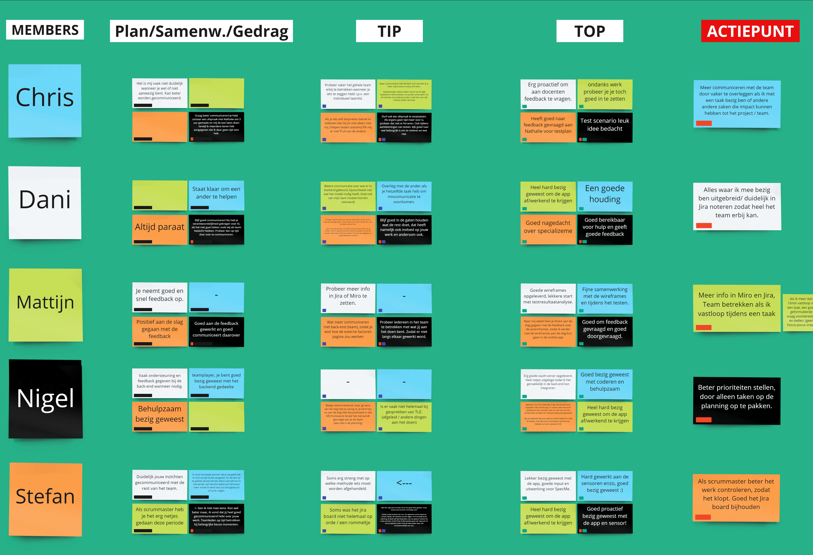

## Feedbackmomenten
Ook deze sprint zijn er weer feedbackmomenten geweest binnen het team. Deze feedbackmomenten hebben veel opgelost binnen het team.
Een voorbeeld hiervan is dat een teamgenoot vaak een andere teamgenoot apart pakte om voor iedereen relevante informatie te bespreken. 
Tijdens een van de feedbackmomenten is dit besproken, en dit is sinds dien niet meer voorgekomen. 

Tijdens de feedback sessies worden er 3 verschillende velden ingevuld. 
- Plannen/Samenwerken/Gedrag
- Tip
- Top 

Bij Plannen/Samenwerken/Gedrag kun je een opmerking opschrijven. Dit kan positief en negatief zijn.
Bij Tip kun je een tip geven over wat de volgende periode beter zou kunnen. Na afloop van de sessie moet iedereen uit deze tips zijn eigen actiepunt halen waar hij/zij aan gaat werken in de volgende sprint. 
Bij Top kun je een compliment geven over wat er goed ging in de vorige periode, vaak is dit in relatie naar het actiepunt van het vorige feedbackmoment. 

Dit is een foto van ons laatste feedbackmoment. Als je deze beter wilt bekijken kun je dit ook openen in [nieuw tabblad](./images/feedbackmoment.jpg)
