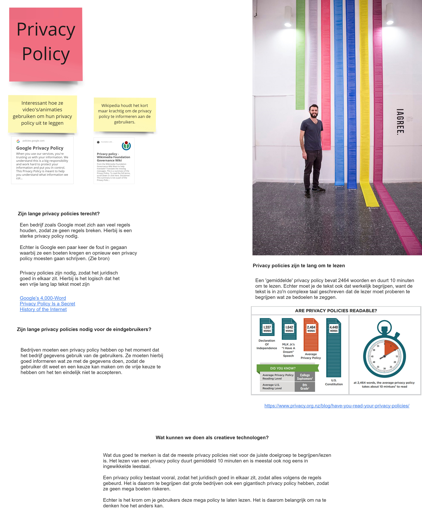
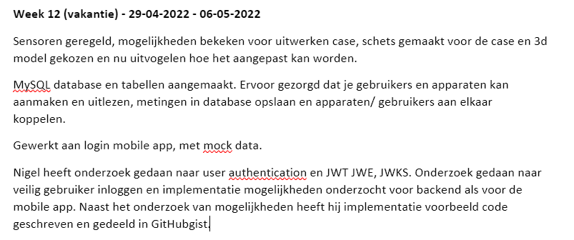
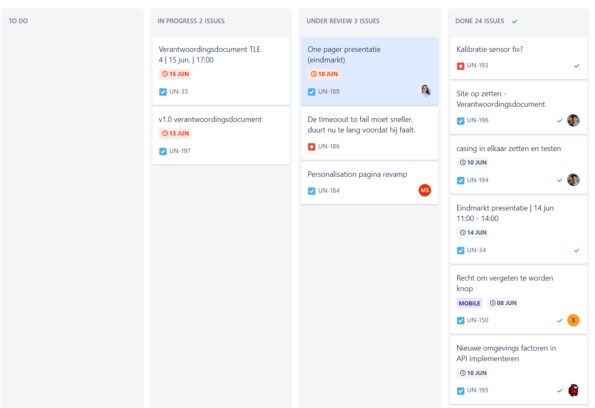
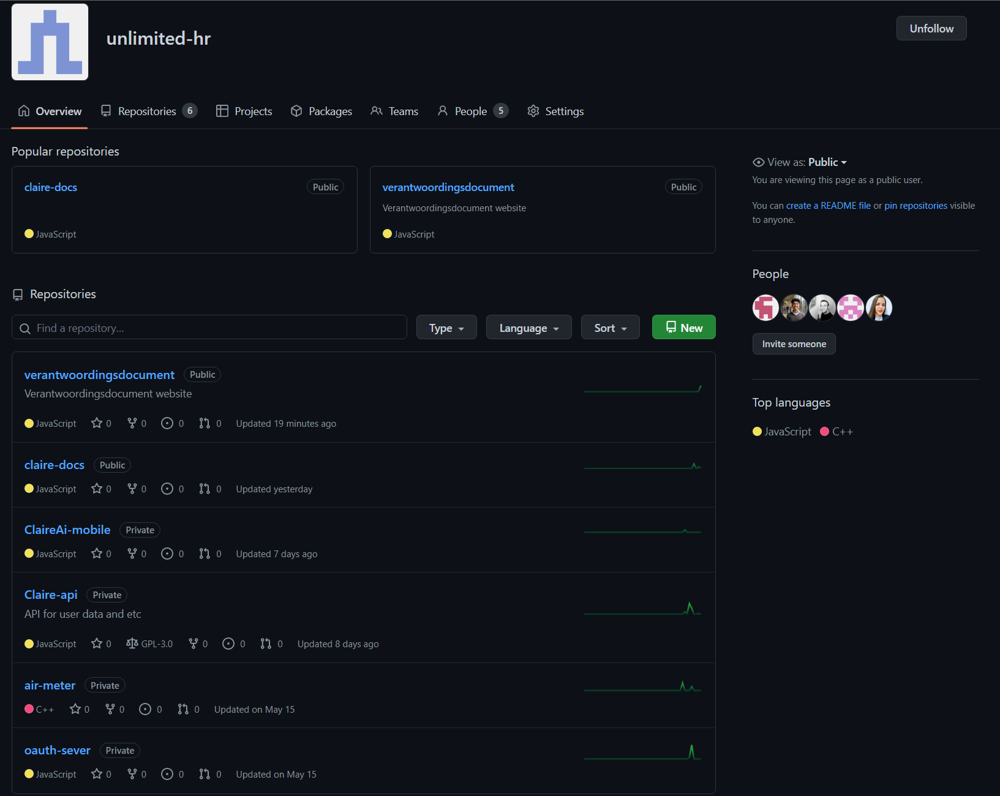

## Situatie & Taak
Aan het einde van TLE 3 kregen wij als team van meerdere docenten te horen dat we niet goed als team samenwerkten. 
Deze feedback hebben wij serieus genomen en we hebben stappen ondernomen om de samenwerking, en dan met name de communicatie binnen het team, te verbeteren. 
Ook kregen wij als feedback op het vorige verantwoordingsdocument dat het niet één geheel was, en dat het aan de hand van allemaal verschillende richtlijnen was geschreven. 
Bij dit verantwoordingsdocument willen we dit voorkomen en een goed en passend document schrijven.

## Actie
We hebben afgesproken op Discord en Whatsapp geen belangrijke informatie meer te delen voor het project. 
Dit hebben we besloten omdat er vaak belangrijke informatie is gedeeld die niet iedereen heeft meegekregen. 
Vanaf TLE 4 hebben we dit alleen nog maar via teams gedaan of besproken toen iedereen erbij was. 

### Miro en logboek
Belangrijke onderzoeken hebben we nu standaard in Miro staan, zoals bijvoorbeeld het privacy policy onderzoek. 

Deze afbeelding is ook te openen in een [nieuw tabblad](./images/priv-policy.jpg).

Belangrijke momenten die we hebben gehad of belangrijke informatie dat we hebben besproken, zetten we standaard in ons logboek.
Het logboek houden we wekelijks bij, en hierin staat wat we welke week gedaan hebben, en wat belangrijk was die week.
We hebben het logboek in Teams bijgehouden.
Een goed voorbeeld van het nut van het logboek was in de vakantie. Sommige teamgenoten hebben wat taken opgepakt in de vakantie, en die hebben dit na afloop in het logboek gezet.
Door dit weet de rest van het team dus ook wat er is gedaan in de vakantie en of er problemen mee zijn geweest. 

Deze afbeelding is ook te openen in een [nieuw tabblad](./images/logboek.png).

### Jira
We hebben, net als vorige periode, Jira gebruikt voor onze planning. We werken ons Jira board bij met elke stand-up en wrap-up. 
Zo blijft het geordend, en weet iedereen van elkaar waar hij/zij mee bezig is. 
Wat wel nieuw is in TLE 4 is dat we meer met deadlines zijn gaan werken. 
Deze beslissing kwam nadat niet iedereen het nut zag van zijn taken snel af krijgen, als je er geen tijdsdruk op staat.
Met deadlines werken heeft ons geholpen om sneller naar de MVP te komen. 

Dit is hoe ons Jira board er momenteel uitziet, helemaal aan het einde van TLE. 

Deze afbeelding is ook te openen in een [nieuw tabblad](./images/jira.png)

### GitHub
In TLE 4 moesten we echt een product maken, dus hadden we een plek nodig om alle code op te slaan. 
Omdat iedereen uit het team wel eens eerder met GitHub heeft gewerkt, was er eigenlijk geen discussie waar we dit zouden doen. 

Op GitHub bestaat de mogelijkheid om een team te maken. In zo'n team kun je dan meerdere repositories maken. Perfect voor Claire dus!
In de afbeelding zijn goed de verschillende repositories te zien die we voor dit project gebruikt hebben. 

Deze afbeelding is ook te openen in een [nieuw tabblad](./images/github.PNG).

### Verantwoordingsdocument
Vanwege de feedback dat het document onoverzichtelijk was, hebben we besloten om dockersaurus te gebruiken in plaats van word om ons verslag in te typen.
In dockersaurus is de styling altijd consistent, omdat het framework daar voor zorgt. 
Daarnaast hebben we de keuze gemaakt om volgens de STARR methode te reflecteren, omdat dit zorgt voor meer structuur door het document heen. 

## Resultaat
Het resultaat hiervan was dat we als team veel meer op 1 lijn zaten en dat we merkten dat progressie boeken veel makkelijker ging. 
Ook hoefden we niet meer aan elkaar te vragen welke dingen waar stonden, omdat deze nu op afgesproken plekken stonden. 
Het resultaat voor het verantwoordingsdocument is een document wat makkelijker te lezen is, en er georganiseerder uit ziet.  

## Reflectie
Als team hebben we een belangrijke les geleerd uit deze situatie. 
De combinatie van hardwerkende personen is handig in een groepje, maar tussen deze personen moet hele goede communicatie zijn. 
Als dit niet het geval is dan moet werk soms dubbel gedaan worden.

### Afspraken met het team
We hebben naast de standaard momenten van TLE op vrijdag met het team afgesproken om bij elkaar te komen om de week af te sluiten, en wat werk te verrichten. 
We hebben voor de vrijdag gekozen omdat de projectdagen dan wat meer verdeeld zijn over de week heen.  
Elke vrijdag werken wij het logboek bij met informatie over wat we afgelopen week gedaan hebben. 
Ook gebruiken we de vrijdag om feedback sessies te doen, deze vonden om de twee weken plaats.
Alles bij elkaar ontmoeten we dus 1x fysiek op de dinsdag en 2x online op de woensdag en vrijdag. 

Elke keer als we aan het project gaan werken hebben we een stand-up en een wrap-up. 
Bij de stand-up bespreken we de taken die vandaag uitgevoerd gaan worden, aan de hand van het Jira board. 
En aan het einde van de dag verteld iedereen even kort wat ieder gedaan heeft, en werken we dit ook weer bij op het Jira board. 
De reden dat we stand-ups houden is zodat we duidelijkheid hebben in het team over wie die dag waaraan gaat werken.  

Tijdens de wrap-ups worden ook belangrijke keuzemomenten besproken, of dingen waar iemand op vastliep. 
De reden dat er wrap-ups worden gehouden is om de planning bij te werken wat er die dag gedaan is. 
Ook is dit een makkelijk moment om om hulp te vragen als er moeite of problemen is met een taak. 

De retrospectives zijn wat moeizaam verlopen tijdens TLE 4, we hebben er maar 1 gehad. Het originele plan was om om de twee weken een retrospective te doen, maar vanuit onze coach kregen wij hier weinig over te horen, en wij hebben zelf niks ingepland omdat we het zo druk hadden met het project.   

Ook tijdens TLE 4 hadden wij weer een wisselende scrum-master. Iedereen is nu een keer scrum-master geweest en heeft hier wat ervaring mee opgedaan. De taak van de scrum-master is om de stand-ups en wrap-ups te leiden. Ook werd de scrummaster vaak aangekeken als contactpersoon als er een taak niet goed ging. 
De scrummaster kon dan iemand uit het team vragen om even mee te kijken, of haar/hem doorverwijzen naar een docent. 

