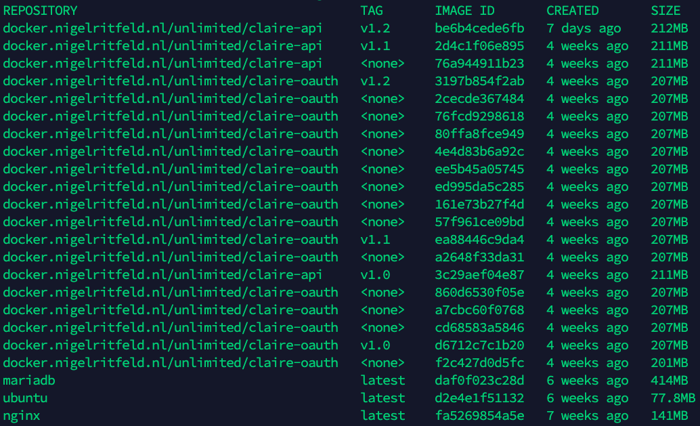

# Ontwerp is Iteratief Ontwikkeld en Geprogrammeerd

## Situatie
We hebben een goed idee van hoe Claire eruit gaat zien. We weten welke tech we
gaan gebruiken om data van het meetapparaat op te slaan en op te halen. We weten
hoe de gebruiker deze data op gaat halen en hoe we advies aan de gebruiker gaan
geven om de luchtkwaliteit binnenshuis te verbeteren.

### Mobile App
Door de wireframes wisten we hoe we de mobile app moesten gaan vormgeven. Dit is dan ook iteratief bijgewerkt, zodat de mobile app ook iteratief doorontwikkeld kon worden.


## Taak
Claire bestaat uit veel verschillende onderdelen. Een back-end server, een app,
een database en een meetapparaat. Deze onderdelen moeten op een manier worden
ontwikkeld die ervoor zorgt dat deze onderdelen zo soepel mogelijk op elkaar
aansluiten.

### Mobile App
De mobile app is volgens de wireframes ontwikkeld. Dit werkte erg goed, omdat de wireframes van tevoren als team goedgekeurd zijn. Hierbij wisten we zeker dat hetgene dat werd geprogrammeerd ook goed was. 


## Actie
Bij het ontwikkelen van de onderdelen proberen we zo snel mogelijk iets werkend
te krijgen. Als we bijvoorbeeld eerst iets met nepdata maken zorgt het ervoor
dat we beter weten hoe we de onderdelen op elkaar af moeten stemmen.

### API
Voor de API is er eerst een database opgezet met wat simpele endpoints die data
ophalen, toevoegen en verwijderen. Dit was snel werkend te krijgen. De code was
nog erg rommelig en het was op dit moment best een gedoe om informatie uit
meerdere tabellen tegelijk op te halen.

```js
// onderdeel van een controller-object (MVC)
async getMeasurement(req, res, options) {
	const user_id = req.params.user_id;
	const connections = await Device_Connection.findAll({where: {"user_id": user_id}})
	let iaq = []

	// for-loop om tabellen te verbinden -_-
	for (let c of connections) {
		console.log(c.device_id)
		let new_iaq = await Measurement.findAll({where: {"device_id": c.device_id}})
		iaq.push(...new_iaq)
	}
	
	return res.send(JSON.stringify(iaq))
}
```

We wilden het grootste deel van de logica in de backend hebben i.p.v. de mobiele
app. Hiervoor zijn wat gespecialiseerde endpoints aangemaakt. Deze maakten het
makkelijk voor de frontend om data gerelateerd aan de gebruiker te manipuleren.
Zo kan je met één request alle data gerelateerd aan een gebruiker verwijderen en
kun je luchtkwaliteit ophalen van alle apparaten die aan een account zijn
gekoppeld.

### Database
Om het probleem met tabellen koppelen uit de API te krijgen is het framework
Sequelize in de backend geïntroduceerd. Dit kostte wat tijd om op te zetten maar
maakte het makkelijker om queries uit te voeren op de database. Ook is één
endpoint met een POST-request veranderd om een GET-request te accepteren, het
meetapparaat bleek niet in staat om te POSTen.

### Authenticatie
De backend moest wel beveiligd worden. Daarvoor is een aparte OAuth server
opgezet. Deze maakt authenticatie tokens die gebonden worden aan een account.
Wanneer er data wordt opgevraagd van een bepaalde gebruiker wordt er op de API
server geverifiëerd dat de juiste auth token mee wordt gegeven.

### Hosting
Om ervoor te zorgen dat de backend makkelijk online kon worden gezet is deze in
een Docker container geplaatst. Dit ging vrij soepel en maakte het wat
makkelijker om nieuwe iteraties te publiceren.



### AI
Voor het testen hadden we gehoopt een AI werkend te hebben, maar hier hadden we
te weinig tijd voor. We hebben in plaats daarvan een nep-endpoint aangemaakt
waar in principe elke keer hetzelfde advies wordt teruggegeven. Dit kon dan in
ieder geval in de mobile app weer worden gegeven.

Na het testen is er een daadwerkelijke AI geïmplementeerd. Deze voorspelt welk
onderdeel van luchtkwaliteit het meest gaat dalen. Hier worden dan
handgeschreven tips aan gekoppeld (b.v. veel fijnstoffen -> ga stofzuigen).

### Mobile App
Toen we de mobiele applicatie gingen testen met gebruikers kregen we de feedback dat het dashboard onduidelijk was. De testers wisten niet goed wat bepaalde waardes inhielden noch wat goed of slecht was. Op basis van deze informatie gingen we itereren. Hiervoor werd er een nieuwe wireframe gemaakt van het dashboard scherm, zodat dit doorontwikkeld kon worden in de mobile app. 


## Resultaat
De backend had bijna elke week wel een nieuwe (grotendeels) werkende versie. Dit
heeft ervoor gezorgd dat we makkelijk konden testen en elkaar informeren hoe
alles op elkaar aan zou moeten sluiten. We na ~3 weken alles aan elkaar
gekoppeld en online gezet voor de usability tests. Doordat alles redelijk goed
op elkaar afgestemd was verliep dit soepel.

Op basis van de usability tests hebben we besloten bij de 4 luchtkwaliteit waarden een informatie-icoon weer te geven Wanneer je op de tegel drukt werd je naar de info pagina van de desbetreffende lucht waarde gestuurd. Op deze pagina krijg je uitleg wat de luchtwaarde betekent en welke waarden goed of slecht zijn. 

## Reflectie
Het is een goede keuze geweest om zo snel mogelijk het absolute minimum van de
backend werkend te krijgen. We hebben vrijwel geen rekening met schaalbaarheid
op lange termijn gehouden en dat heeft ons toch wat tijd gescheeld.

Door middel van het testen hebben we vastgesteld dat het dashboard niet duidelijk genoeg was. Op basis van deze conclusie zijn er aanbevelingen gedaan voor de doorontwikkeling van de applicatie. We hebben op de wireframes geïtereerd, zodat er doorontwikkeling plaats kon vinden voor de applicatie.

Doordat we de applicatie hebben getest hebben heeft er doorontwikkeling plaats gevonden waar we eerder niet aan hadden gedacht. Dit is voor ons een leerzame ervaring om te zien, want eigenlijk dachten we dat de applicatie super gebruiksvriendelijk was. 

<!--
Iteraties?
- Eerste versie algemene endpoints die met MySQL DB communiceren
- DB-communicatie ge refactored, database migrations en associations met Sequelize
- Gespecialiseerde endpoints. "Vergeet mij"-knop, IAQ mbv user opvragen ipv device
- Authenticatie van OAuth server geïmplementeerd.
- Docker container
- Nep-AI
- Ietswat functionele AI


## Gereflecteerd, Conclusies Getrokken en Aanbevelingen Gedaan voor Doorontwikkeling
Na eerste iteratie suggesties opgenomen en geïmplementeerd mbt endpoints <br>
Erachter gekomen dat sensor alleen GET-requests kan doen. API aangepast <br>
Endpoint documentatie was eerst niet heel duidelijk, opnieuw geformat <br>
Eerst niet van plan te dockerizen, maar omdat iemand anders het op de server
moest zetten toch gedaan. <br>


Situatie, Taak, Actie, Resultaat, Reflectie
-->
