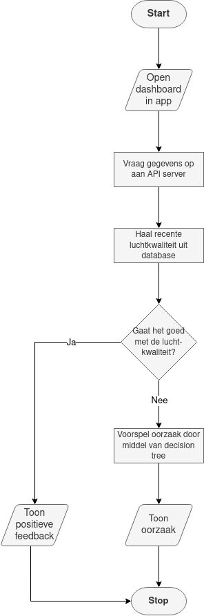
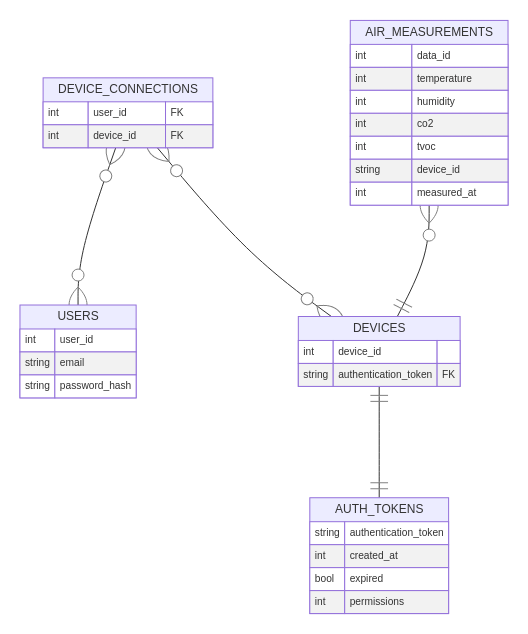
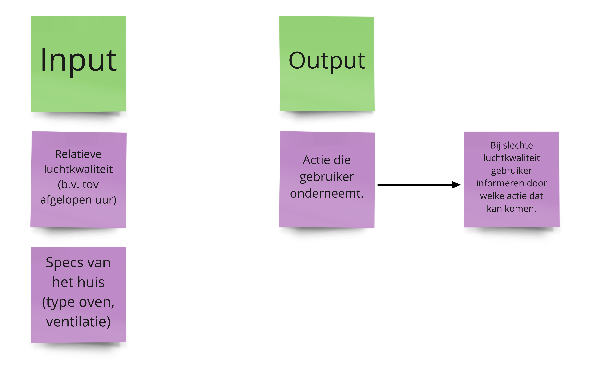
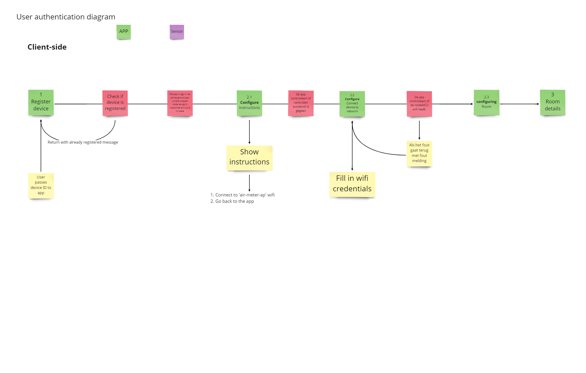

# Technisch Ontwerp Gerealiseerd
<!-- 
- decision tree implementatie
- Database ERD
- Flowchart
-->
## Situatie
We hebben op dit punt vastgesteld welke technologieën we gaan gebruiken om data
op te slaan, te communiceren met het meetapparaat en de telefoon en om advies
voor de gebruiker te genereren.
Ook hebben we een technisch ontwerp gemaakt voor het installatieprocess van de mobiele app. Met installatie bedoelen wij het proces waarbij de gebruiker een account maak, IoT device instelt en externe factoren in vult. 

## Taak
Het is niet verstandig om blind de verschillende onderdelen te programmeren.
Voordat we echt gaan ontwikkelen maken we een technisch ontwerp. Dit is handig
om de structuur van de verschillende onderdelen in kaart te brengen. Dit ontwerp
helpt er ook mee om ervoor te zorgen dat we binnen het team op één lijn zitten.
Ook kunnen we binnen de code makkelijker een structuur hanteren en gaat het
schrijven van de user stories wat soepeler.

De taak was om voor onszelf duidelijk te maken wat de flow van het installatieprocess zou moeten zijn, zodat zowel de back-end en mobile app weet wat hij/zij moet gaan doen.

## Actie

### API
Om in kaart te brengen wanneer de mobiele app data van de server nodig heeft
is er een flowchart gemaakt. Deze licht toe wanneer er luchtkwaliteit en wanneer
er advies wordt opgevraagd.

### Database
Voor de database is er een ERD gemaakt. Deze geeft alle data weer in de vorm van
tabellen. Ook illustreert dit de connecties tussen bepaalde data, zoals dat een
gemeten luchtwaarde aan het corresponderende meetapparaat gekoppeld zit. Door
eerst een ERD te maken konden we makkelijk aan elkaar communiceren hoe de
database eruit gaat zien. In het geval iemand een probleem ontdekt met de
structuur kan dit makkelijk aangepast worden. Ook maakt dit het makkelijker om
de echte database op te zetten.

### AI
Voor de Decision Tree/ de AI is er gekozen om het te trainen om bij gebrekkige
luchtkwaliteit de oorzaak hiervan op te sporen. Dit wordt gedaan door het een
'logboek' te voeren in combinatie met data over luchtwaliteit. Zo kan er worden
voorspeld wanneer de gebruiker bijvoorbeeld aan het koken is. Hier kunnen we dan
tips aan koppelen als "zet de afzuigkap aan". De tips zelf zijn handgeschreven.

(Kaartjes onder input definiëren de data die de AI gebruikt om de kaartjes/ data
onder output te genereren.)
Op dit moment waren we nog niet zeker over welke exacte factoren van de omgeving
van de gebruiker we zouden gebruiken voor de AI, daardoor komt deze informatie
niet terug in de ERD.

### Installatieprocess
We hebben ervoor gekozen om de flow van het installatieprocess via Miro te visualiseren wat de stappen zou moeten zijn.

## Resultaat
### AI
Onze implementatie van een Decision Tree is ambitieus gebleken. We hadden online
een dataset met luchtkwaliteit en een logboek gevonden. Dit was goed voor
prototyping maar de data bevat factoren die de gebruiker misschien niet weet.
Ook is het met andere sensoren gemeten dan wij gebruiken voor het meetapparaat.
Daarnaast is het in Californië gemeten, een geheel ander klimaat dan Rotterdam.
Als we dit daadwerkelijk in ons project zouden willen gebruiken zouden we zelf
de data moeten verzamelen. Dit zou echter ontzettend veel tijd kosten en pastte
niet binnen het project.

[Dataset](https://datadryad.org/stash/dataset/doi:10.7941/D1ZS7X)

Uiteindelijk hebben we de AI omgebouwd om te voorspellen welke onderdeel van de
luchtkwaliteit in de toekomst achteruit zal gaan. We hoeven hiervoor geen
logboek bij te houden maar kunnen zonder handmatige interventie gewoon de sensor
laten draaien om nuttige data te verzamelen.

### API
De flowchart heeft geholpen met de technische implementatie van de backend. Het
maakt goed duidelijk wanneer en wat voor data de mobiele app uit de database
nodig heeft.

### Database
De ERD was aan het begin erg handig. Het maakt de database goed inzichtelijk.
Over de loop van ontwikkelingen zijn er wat tweaks gemaakt binnen de database,
dit zorgde op het gegeven moment ook voor wat onduidelijkheid over welke
gegevens we erin opslaan. De uiteindelijke database ziet er heel anders uit dan
de ERD die aan het begin is gemaakt. Dit zorgde voor onduidelijkheid waardoor er
minder soepel code geschreven kon worden die met de database communiceert.

### Installatieprocess
Het visualiseren van het installatieproces in Miro resulteerde in een duidelijke visuele flow waarbij we goed konden zien wat de stappen zouden moeten zijn. Hierdoor konden we als team goed op discussiëren/debatteren over bepaalde keuzes.

## Reflectie
Door de technische ontwerpen te realiseren hebben we allemaal een helder beeld kunnen ontwikkelen van wat op dit gebied de bedoeling was. Als je een visie hebt van hoe iets moet en het blijft in je hoofd lijdt dit snel tot slordige communicatie. Door het visueel te tonen wist iedereen hoe laat het was.

### Database
De ERD is over de loop van het project een beetje z'n nut verloren. Dit komt
omdat deze op het gegeven moment niet meer overeenkwam met de daadwerkelijke
database. Het is op zich niet raar dat tijdens het ontwikkelen van de app blijkt
dat er iets in de database aangepast moet worden, maar we hadden hierbij ook de
ERD moeten updaten. Aan het eind was er wel onduidelijkheid over hoe de database
er uitzag, alleen degenen die er direct mee te maken hadden wisten dit. Als we
de ERD up-to-date hadden gehouden had dit voor minder verwarring gezorgd.

### AI
We hebben het AI-gedeelte tijdens het ontwerpen wat onderschat. Het klonk leuk
om 'tips te genereren' met een algoritme maar we hadden meer tijd moeten
besteden aan onderzoek naar hoe we dit konden doen. Wat we aan het begin hadden,
oorzaak van slechte luchtkwaliteit voorspellen, is in principe wel mogelijk maar
verreist veel data die we niet hebben en moeilijk te verzamelen is. We hebben
het nog 'om kunnen bouwen' naar iets wat beter binnen het project past maar we
zijn hier toch wel wat tijd aan verloren.

