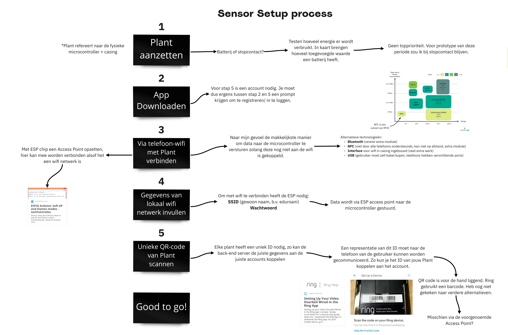
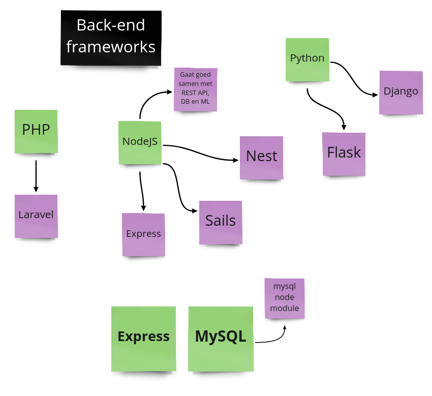
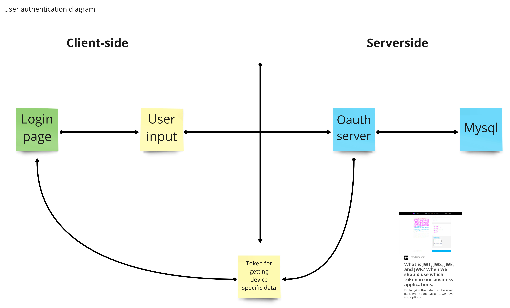

# Onderzoek naar Technische Mogelijkheden
<!--
- NodeJS + Express; React Native; MySQL
- Decision Tree (transparant algoritme)
- Wi-Fi® om met sensor te communiceren

https://datadryad.org/stash/dataset/doi:10.7941/D1ZS7X

### Situatie
Claire moet gegevens die op het meetapparaat worden gemeten kunnen weergeven op
de mobiele app. Ook moet er mobiele app advies kunnen geven om de luchtkwaliteit
te verbeteren. Om ervoor te zorgen dat je ook buitenshuis deze data in kan zien
wordt de data verstuurd naar en opgeslagen op een webserver.

### Taak
Om van start te kunnen gaan met de technische realisatie van Claire moeten we
allereerst vaststellen welke technologieën we gaan gebruiken. We moeten weten
wat voor database we gaan gebruiken, waarmee we de back-end server gaan maken en
wat voor algoritme we gaan gebruiken om de gebruiker tips te geven.
-->

## Situatie
Claire moet gegevens die op het meetapparaat worden gemeten kunnen weergeven op
een mobiele app. Ook moet de mobiele app advies kunnen geven over hoe je bij jou
de luchtkwaliteit kan verbeteren.
De mobile app werkt samen met het IoT device. Het IoT device heeft internet nodig om lucht gegevens te sturen naar de back-end. Hiervoor moet dus het IoT device ingesteld worden. Er is daarvoor een persoonlijk Wi-Fi® netwerk voor nodig. Dit dient ingesteld te worden door de gebruiker, maar moet wel een goeie ervaring zijn. Hier hadden we onderzoek naar gedaan. 

## Taak
Om van start te kunnen gaan met de technische realisatie van Claire moeten we
allereerst vaststellen welke technologieën we gaan gebruiken. We moeten weten
hoe/waar we de data op gaan slaan, hoe we dit naar de app gaan sturen en hoe we
hiermee tips aan de gebruiker kunnen geven. Ook moeten we vaststellen hoe we
het account van de gebruiker gaan beveiligen.
Het moeilijkste gedeelte van de mobiele app was om de Wi-Fi® in te stellen op het IoT device. Dit wilden we doen via de mobile app, zodat de user experience als fijn wordt ervaren. Hiervoor hebben we kort onderzoek gedaan bij naar concurenten. Één van de concurenten was Google. Hierbij keken we hoe Google hun devices instelde. 

## Actie
### Communicatie Sensor
We zijn gestart met de technologieën die de sensor gaat gebruiken voor 
communicatie. Om ervoor te zorgen dat je de app buitenshuis kan gebruiken is het
nodig voor het meetapparaat om via de lokale Wi-Fi® data naar een webserver te
sturen. Hiervoor hebben we naar een manier gezocht voor de gebruiker om de naam
en het wachtwoord van een Wi-Fi® netwerk naar het apparaat te sturen.

### Database + API
Op de webserver moet CRUD worden geïmplementeerd om de data te kunnen verwerken.
Hiervoor hebben we een technologie gezocht voor de database en voor de server
zelf. We hadden op dit punt niet ontzettend veel tijd resterend in het project,
dus bij het zoeken van technologieën is er gefocust op wat we al kennen. Hiermee
kunnen we efficiënt ons product bouwen.

We hebben uiteindelijk gekozen om te werken met NodeJS + Express voor de server
en MySQL voor de database. Er is online veel hulp te vinden over deze tech en we
zijn hier al bekend mee.

### AI
Ook zochten we wat voor algoritmen en frameworks we kunnen gebruiken om voor de
gebruiker tips te genereren. Hierbij willen we een transparant algoritme
gebruiken. De gezondheid van de gebruiker's leefomgeving moet met veel zorg
worden behandeld, we willen de mogelijkheid hebben om in te zien waarom de
server een bepaalde aanbeveling doet zodat we makkelijker de oorzaak kunnen
opsporen wanneer dit fout gaat.

Als algoritme is er gekozen om een Decision Tree te gebruiken. Dit hebben we in
de les behandeld en is vrij makkelijk om op te zetten. Het is transparant omdat
je precies de beslissingen die genomen zijn kan inzien en het is flexibel in wat
voor data je eraan kan voeren.

### Authenticatie
Om de gegevens van de gebruiker te beveiligen willen we werken met authenticatie
tokens. De gebruiker maakt een account aan met Email en wachtwoord, dit wordt
ge-encrypt (Email) en gehasht (wachtwoord). Wanneer je inlogt wordt er een auth
token naar de app gestuurd. Deze wordt lokaal opgeslagen. Wanneer je data
opvraagt die aan een account gebonden is MOET je de goede token meegeven. Het
aanmaken van deze tokens (en dus inloggen) gaat via een aparte authenticatie
server. We hebben online gezocht naar algoritme/ technologieën hiervoor en
hebben gekozen JSON Web Tokens te gebruiken.

[Introductie JWT Tokens](https://medium.com/@goynikhil/what-is-jwt-jws-jwe-and-jwk-when-we-should-use-which-token-in-our-business-applications-74ae91f7c96b)

### Installatieprocess
[Google Setup](https://www.youtube.com/watch?v=oFPMZLeIo5M&ab_channel=ASecureLife)

Op basis van het korte onderzoek gingen we zelf kijken wat we konden doen met de NodeMCU en het gekozen mobile app framework. Op de NodeMCU is het mogelijk om een library te installeren waarbij er een access point wordt opgezet wanneer de NodeMCU geen internet heeft. Op de access point is er een webpagina waarbij je jouw Wi-Fi® gegevens kan invullen, zodat de NodeMCU internet heeft. Waar we achter gekomen waren is dat je dit ook zonder de webpagina kan doen. We kunnen namelijk ook de GET url gebruiken: `192.168.4.1/&ssid=MIJNNETWERK&PASSWORD=123456789`. Op deze manier kunnen we via de mobile app de GET request doen, zodat we niet opeens in een andere interface de gegevens in moeten vullen. Hierbij blijft de user experience strak.

## Resultaat
### API + Database
De back-end technologieën zijn allemaal goed van pas gekomen. Het ontwikkelen
van de API duurde niet al te lang en het eindproduct werkt naar behoren. Het
hielp dat we voor programmeertalen gekozen hebben die we allemaal al kenden
omdat het daardoor makkelijker was om hulp te vragen bij een teamgenoot als er
iets mis ging.

Voor de database hebben we uiteindelijk nog 'Sequelize', een framework voor
Object Relational Mapping, toegevoegd aan de tech stack. Dit maakte communicatie
met de database net iets makkelijker dan zelf queries schrijven. Dit was best
makkelijk te integreren binnen onze bestaande code. Ondanks dat we dus de
complexiteit van de database-communicatie een beetje hadden onderschat zijn we
hier niet veel tijd aan verloren.

### Hosting
We hebben later besloten om Docker te gebruiken om het hosten van de back-end
makkelijker te maken. Dit hebben we vooral gedaan zodat iemand die niet zelf aan
de back-end werkt het online kon zetten, zonder Docker bleek het moeilijk om
handmatig alles te installeren.

### AI
De Decision Tree is een goed algoritme voor de AI gebleken. Het is erg breed en
het technische aspect was niet al te moeilijk om op te zetten. We hebben wel
gekozen voor de Decision Tree die op school behandeld is, niet die van
Tensorflow zoals in het ontwerp staat. Die uit de programmeerlessen was toch 
makkelijker te gebruiken. Deze zou wat minder efficiënt zijn dan die van
Tensorflow maar dat is geen probleem gebleken.

### Authenticatie
De web tokens hebben de app goed beveiligd. Het aanmaken gaat goed en ze werken
op een manier dat we kunnen garanderen dat een token tot een specifiek account
behoort. Wanneer iemand met de juiste credentials data aanvraagt gaat dit
soepel, de veiligheid gaat niet ten koste van de gebruikerservaring.

### Communicatie Sensor
Met het onderzoek over het instellen van de Wi-Fi®. Gingen we aan de slag met het technische ontwerp, zodat we een nog duidelijker beeld kregen van hoe we de flow van de back-end en mobile app moeten gaan realiseren.

## Reflectie
### API
We hebben voor goede frameworks gekozen om onze app te maken. Het onderzoek
hiernaar heeft ook niet te veel tijd gekost. Een grote reden dat dit zo soepel
ging is dat we echt naar de praktische waarden van de technologieën hebben
gekeken. Het was erg verlijdelijk een framework te kiezen waar we niet/ slecht
behendig mee waren, maar binnen dit project hadden we niet de tijd gehad om
zoiets nieuws te leren.

### Hosting
We hebben bij het kiezen van technologieën niet echt nagedacht over hoe we de
backend gaan hosten. Dit zorgde voor wat gedoe toen we voor de usability tests
alles online moesten zetten. Het is uiteindelijk goed gekomen, we hebben in
redelijke tijd alles met Docker container op Microsoft Azure gehost, maar in de
toekomst is het toch handiger om hier aan het begin rekening mee te houden. Als
niemand in het team toegang tot Azure had gehad en niemand in het team ervaring
met Docker had gehad zou dit slechter uit kunnen hebben gepakt.

### Meetapparaat
Doordat we eerst onderzoek deden naar IoT devices die hetzelfde deden als wij hoefde we het wiel niet opnieuw uit te vinden. Dit is slim, omdat er zo geen tijd wordt verspild. Ook leer je wat überhaupt een goede flow is bij het koppelen van een IoT device omdat je bij een partij gaat kijken die er alles ervan af weet en het ook in de echt wereld hebben toegepast. Wat echter beter kon was het documenteren van het onderzoek. Dit hebben we nu niet ergens specifiek staan van het onderzoek over IoT devices. Dit is slecht omdat 1 iemand het nu weet en niet het gehele groepje. We konden dit beter in Miro documenteren, zodat iedereen het onderzoek over IoT devices kon inzien.

### Authenticatie
Voor de oauth server zijn goede technologieën uitgekozen. Er is online veel info
over te vinden wat ontwikkeling makkelijker maakt. Het is in theorie erg veilig,
zonder token kun je niet binnenkomen. Onze desk research heeft aangeduid dat het
moeilijk is om een token te vervalsen.

