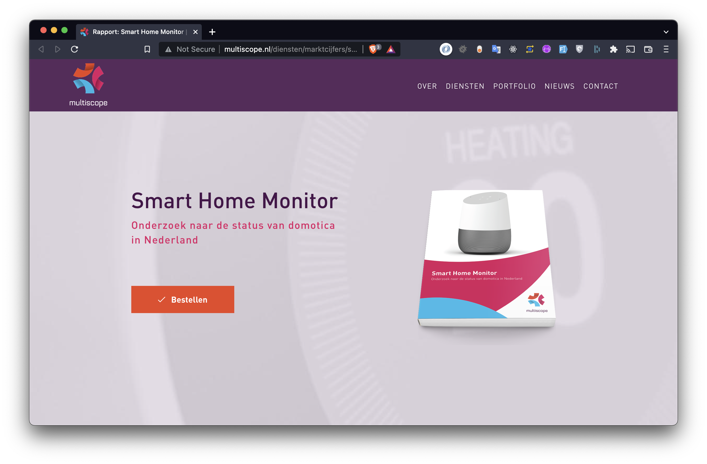
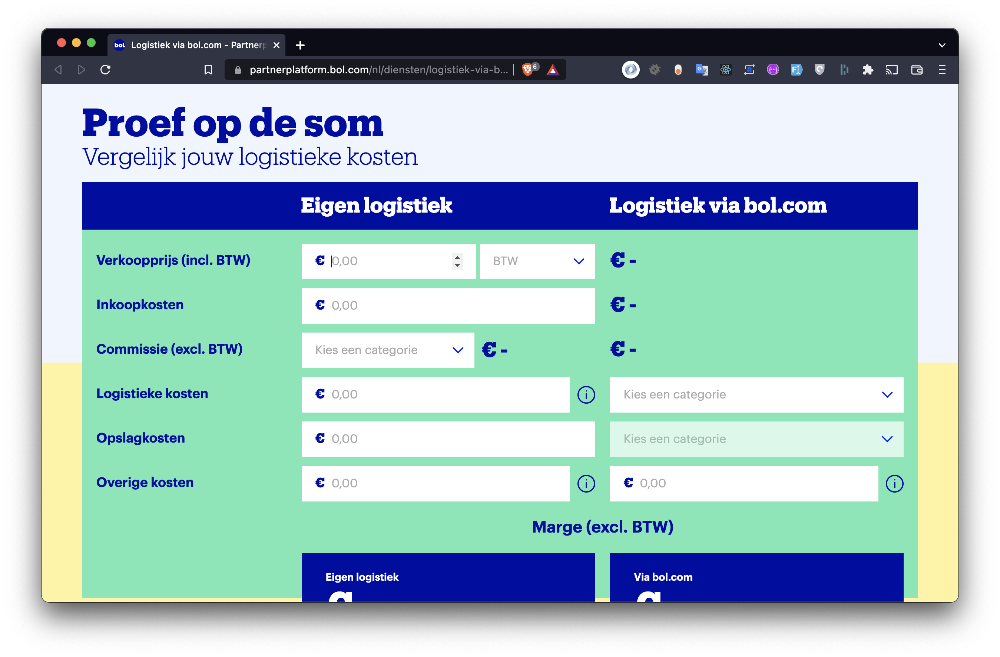
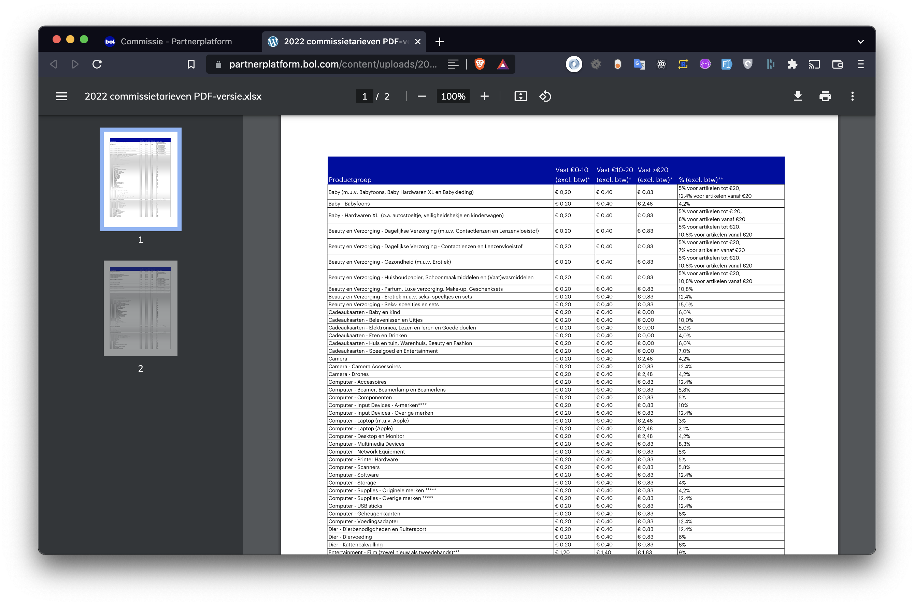
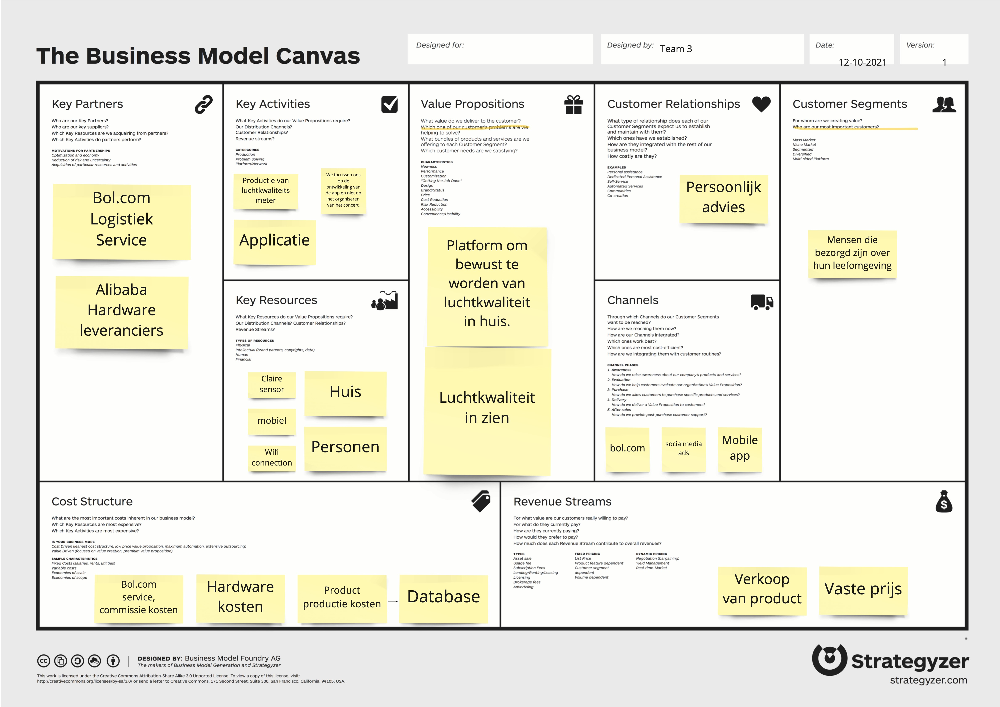
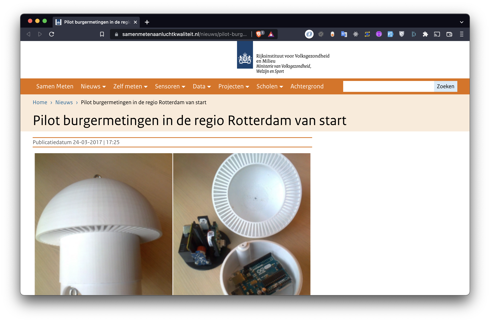
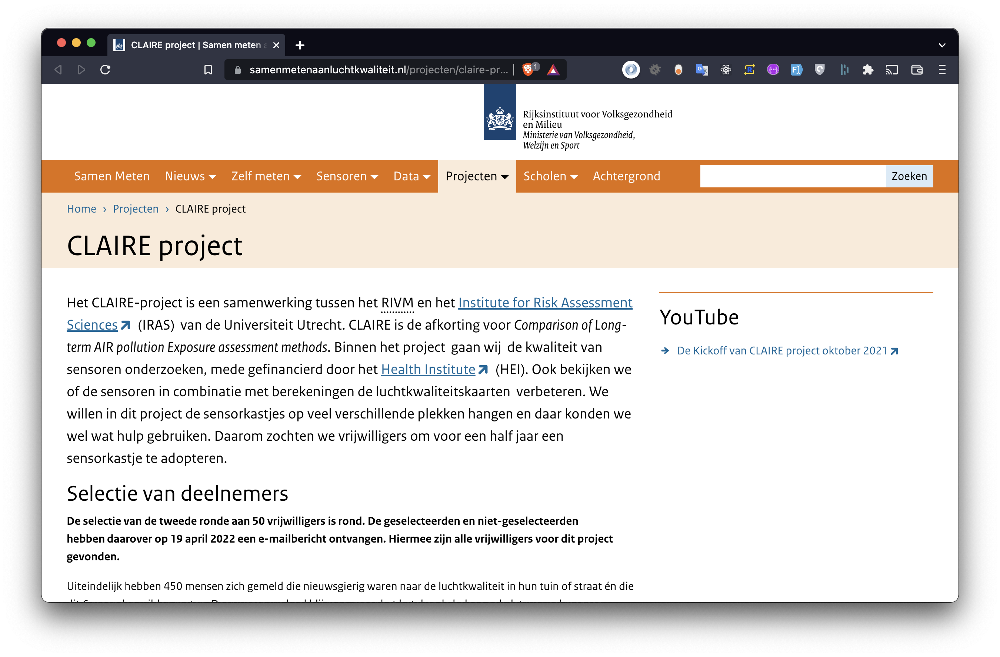
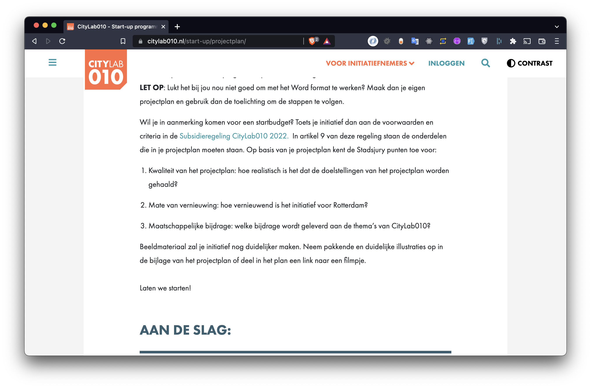
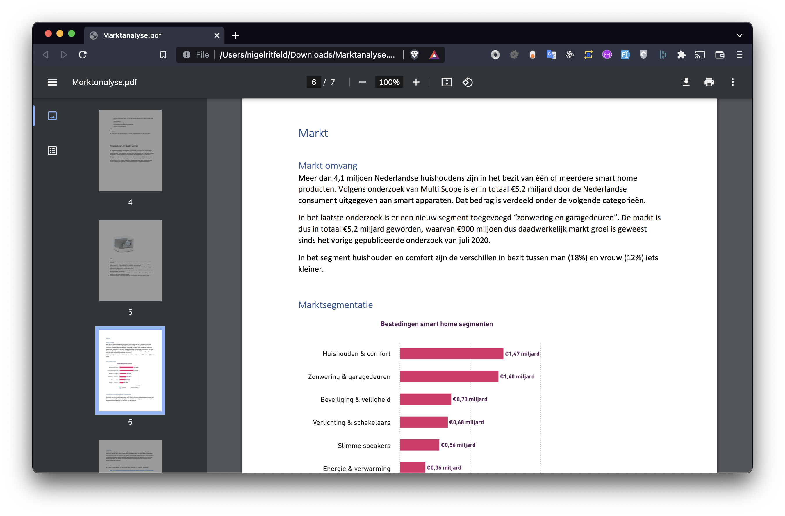
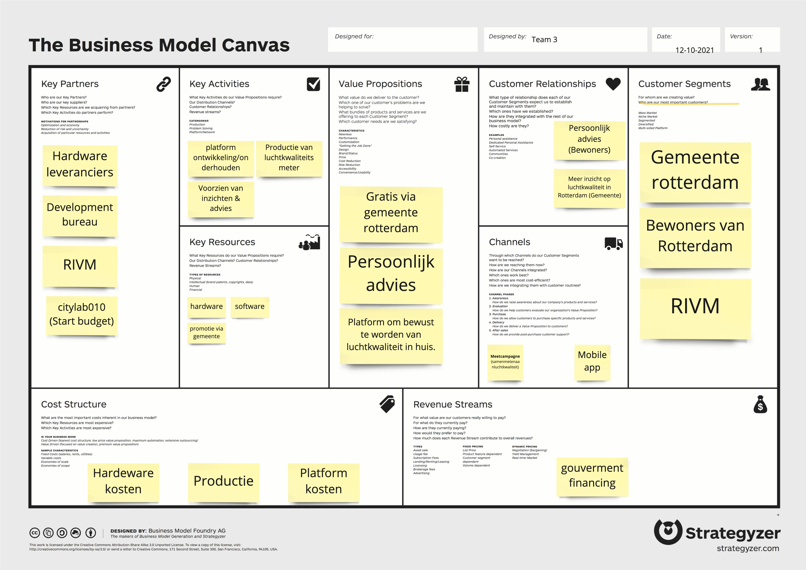

## Situatie
Deze periode hebben wij onderzoek gedaan naar de mogelijkheden om ons product te verkopen.
In de vorige TLE hebben wij een eerste versie van een business model gemaakt, waarbij er nog veel ontbrak.
Er was nog niet over na gedacht over de productie en distributie.

## Taak
Wij moeten onderzoeken hoe wij onze doelgroep gaan benaderen.
Wij weten nog niet hoe de markt in elkaar zit en hoe groot die is.
Pas als deze onderdelen duidelijk zijn kunnen wij verder met het ontwikkelen van een business model.

## Actie

### Marktanalyse
Wij zijn verder gegaan met het analyseren van de markt. Tijdens het zoeken kwamen wij op waardevolle artikelen van Multiscope.
Multiscope is een bureau die online marktonderzoek doet. Het bedrijf heeft dus markt onderzoek gedaan naar IOT Markt in nederland.
Uit die bron hebben wij cijfers kunnen vinden over wat marktomvang is en ook welke marktsegmenten er zijn.

Uit die bronnen kwamen wij op het inzicht dat de grootste distributie kanalen in nederland de volgende bedrijven zijn:
1. Coolblue
2. Bol.com
3. Mediamarkt

Toen hebben wij gekeken of het mogelijk is om via deze platformen onze production aan te bieden aan de bestaande markt.
Eerst hebben wij op de websites van deze platformen gekeken of er bestaande partner programma's zijn.
Op de website van Coolblue staat er alleen een partner programma voor influencers.
Binnen ons netwerk hebben wij gevraagd aan een medewerker van Coolblue of het mogelijk is om een product aan te bieden via het platform.
Die gaf aan het platform zelf producten inkoopt en niet zomaar mogelijk is om jouw product aan te bieden op hun platform.

### Verkopen via Bol.com
Bij bol.com staat op nummer twee van de grootste distributie kanalen.
Op de website hebben wij meer kunnen vinden over het process om jouw product via hun platform aan te bieden.

Al gauw kwamen wij er achter dat je bij bol.com veel geld kwijt gaat zijn aan comissiekosten
en service kosten voor het verpakken, opslaan en verzenden van onze producten.

### E-commerce business model
Wij hebben deze inzichten in deze inzichten gebruikt om een business model te maken.
Hier onder vind je de business model.

### Feedback
Wij hebben aan onze ondernemen docent feedback gevraagd en
het advies gekregen dat we zouden moeten spelen met ons model en kijken hoe wat uit eindelijk het beste is.
Na de feedback hebben wij gekeken naar andere mogelijke stakeholders. Het project speelde zich af binnen Rotterdam.
Hebben wij gekeken naar hoe verre het mogelijk is om subsidie te krijgen van uit de gemeente.

### Gemeente onderzoek

Op basis van de feedback hebben wij ook gekeken naar het scenario dat wij focussen op gemeente Rotterdam.
Wij zijn begonnen met online research om te kijken wat de gemeente momenteel doet om luchtkwaliteit te verbeteren.
Er zijn een aantal initiatieven en pilots vanuit de gemeente.
Er is een project gestart een paar weken geleden die heet helaas 'het claire project'.
Dit project is er om de luchtkwaliteit in rotterdam in kaart te brengen. Dit gaat om de luchtkwaliteit buitenhuis.
Ons project sluit hier goed op aan. Dit zouden wij in een latere fase nog kunnen valideren.

Via de website Creative 010, hebben wij meer informatie gevonden hoe wij met ons project mogelijk zouden kunnen financieren.
Wij hebben de voorwaarden van City Lab doorgenomen en ons project komt in aanmerking.
Het is alleen niet gegarandeerd dat het project gefinancierd word, omdat het een competitie is en het beste concept een eenmalige financiering krijgt.

## Resultaat

### Marktanalyse
Al het onderzoek heeft geleid tot een document, waarin wij onze markt inzichten hebben vastgesteld om te delen in het team.

Open [markt analyse](./files/Marktanalyse.pdf)

### Business model
Het definitieve business model dat wij hebben gekozen is hier onder te zien.
Wij hebben ervoor gekozen om te richten op de gemeente Rotterdam.
De reden daarvoor is omdat het businessmodel als via E-commerce platformen met de huidige samenstelling niet rendabel gaat zijn.
Het ontwikkelen en onderhouden van het platform gaat te veel kosten. Daarnaast zouden wij te veel van de winst marge kwijt zijn aan comissies.

## Reflectie

### Business model
Het onderzoeken van business model was voor ons best uitdagend.
Het heeft ons veel inzicht gegeven over wat er allemaal bij komt kijken als je een product op de markt wil gaan brengen.
Daarnaast hebben wij nu een business model, waarvan wij niet zeker weten of het concept genoeg winst mee gaat maken.
Dat zouden we de volgende keer beter kunnen laten valideren door partners en expers.

### Marktanalyse
Het analyseren van de markt heeft ons op weg geholpen met het positioneren van ons product.
We hadden meer bronnen moeten gebruiken voor het onderzoek.
Het is een risico om een business model te baseren op een onderzoek die merendeels bestaat uit een bron.

