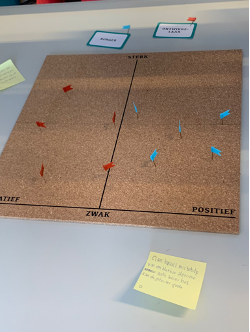
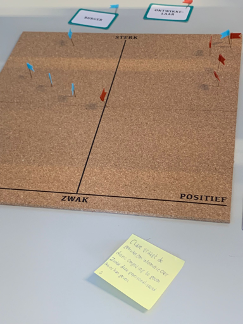
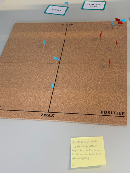
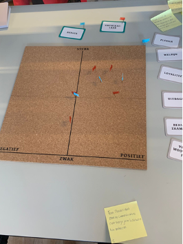

# Situatie

# Taak
- sdfsf

# Actie

### Make Me Think
Dit hebben wij gedaan door meerdere brainstorm sessies en Make Me Think framework te gebruiken.
In deze sessie hebben wij een aantal stellingen bedacht waarbij wij ons gingen verplaatsen in de eindgebruiker en in de

  
  

# Resultaat

# Reflectie

maatschappelijke impact
