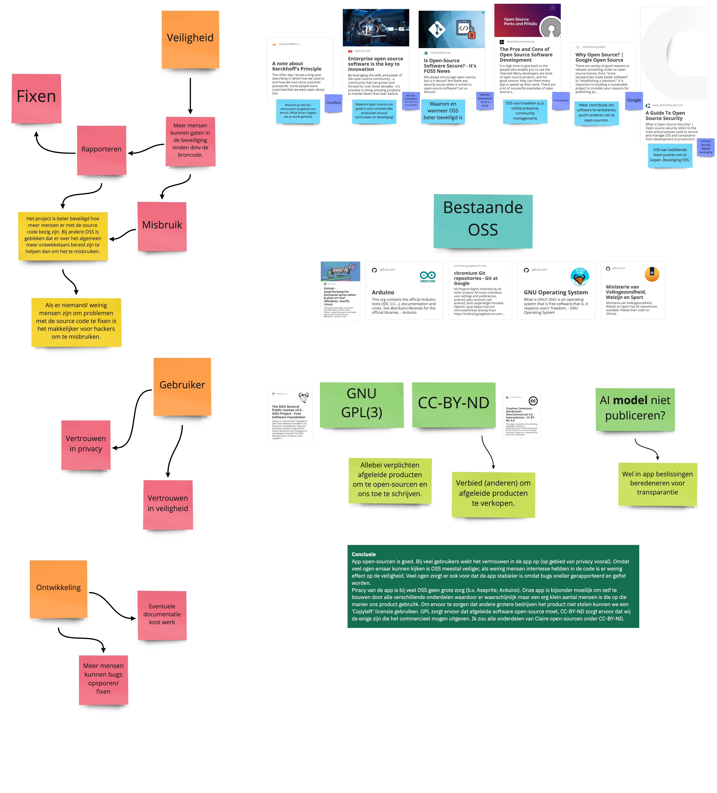
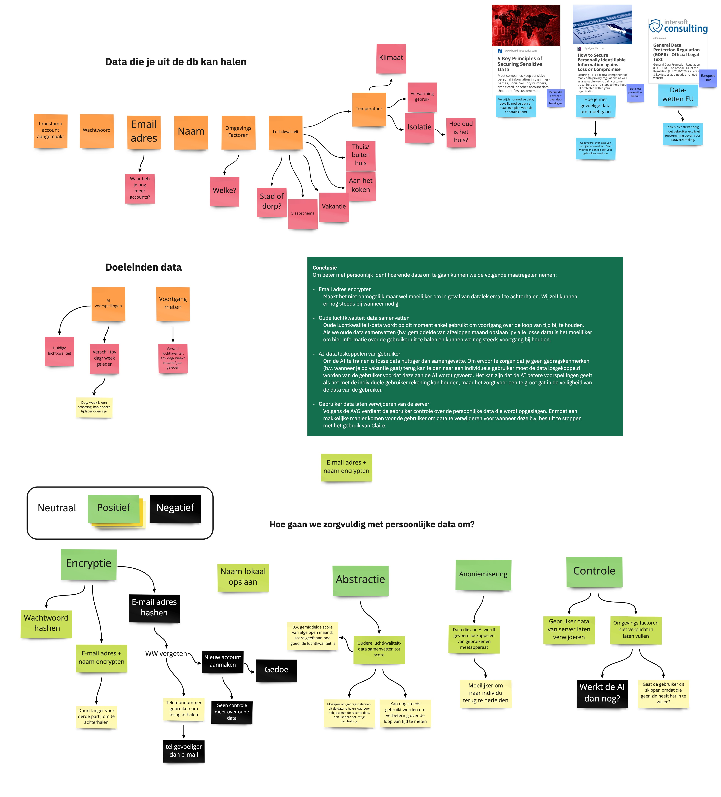
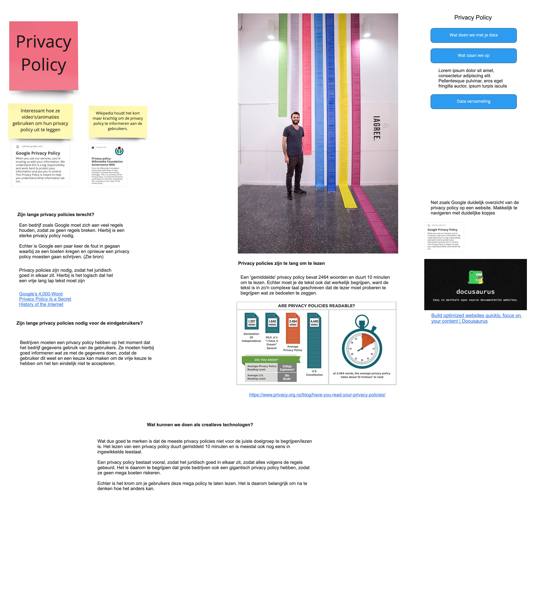
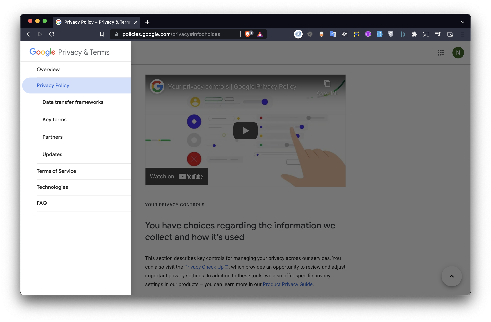

# Situatie
In dit project worden er veel gebruikersgegevens verwerkt. Daarbij komt er veel kijken.
Hoe zorgen wij ervoor dat de gegevens veilig worden opgeslagen? Wat voor effect heeft het op de
eindgebruikers als er data gelekt word? Hoe houden wij rekening met al die scenario's?

# Taak
Wij moeten na denken over de impact die wij willen maken, maar ook over de effecten daarvan.
Dat doen wij om onvoorziene situaties te vermijden en een verantwoord product op de markt te brengen.

- Na denken over de maatschappelijke impact

# Actie

In deze periode hebben wij onderzoek gedaan naar dataverwerking, privacy, accessibility

### Open sourcing
Wij hebben gekeken naar de voordelen en nadelen van het open-sourcen van de code.
Uit het onderzoek is gebleken dat het open-sourcen van het project, zorgt voor transparantie en vertrouwen voor de eindgebruikers.
Bij veel gebruikers wekt het vertrouwen in de app op (op gebied van privacy vooral). Omdat veel ogen ernaar kunnen kijken is OSS meestal veiliger, als weinig mensen interesse hebben in de code is er weinig effect op de veiligheid. Veel ogen zorgt er ook voor dat de app stabieler is omdat bugs sneller gerapporteerd en gefixt worden.
Piracy van de app is bij veel OSS geen grote zorg (b.v. Aseprite; Arduino). Onze app is bijzonder moeilijk om zelf te bouwen door alle verschillende onderdelen waardoor er waarschijnlijk maar een erg klein aantal mensen is die op die manier ons product gebruikt.
Hier onder vind je een foto van het onderzoek in uit miro.

### Gegevens verwerking
Naast het onderzoek van open-sourcing hebben wij ook onderzoek gedaan naar het verwerken van persoonsgegevens.
Uit het onderzoek hebben wij inzichten op kunnen halen die wij hebben geïmplementeerd in ons project.
Een voorbeeld daarvan is: "De betrokkene heeft het recht om van de voor de verwerking verantwoordelijke te verlangen dat de hem betreffende persoonsgegevens zonder onnodige vertraging worden gewist en de voor de verwerking verantwoordelijke heeft de verplichting om persoonsgegevens zonder onnodige vertraging te wissen".
Dit is afkomstig uit het AVG. Dat betekent dat de eindgebruikers recht hebben om vergeten te worden uit het systeem.
Dit hebben wij ook toegepast in onze applicatie door middel van een knop op de settings pagina, waarna het indrukken de gebruiker zijn gegevens worden verwijderd.

### Privacy policy
Ook is er onderzoek gedaan naar de mogelijkheden van privacy policy op een overzichtelijke en transparante manier te delen met de eindgebruikers.

Dat hebben wij wegens tijd nood helaas niet meer kunnen verwerken in het project.
We zijn wel op creatieve manieren gekomen om dat op een overzichtelijke manier terug te koppelen met de eindgebruikers.
Wij hebben inspiratie op gedaan van google en hebben gekeken naar de mogelijkheden om een site te maken die altijd bereikbaar is
(buiten de app) zodat de gebruikers die altijd kunnen terug lezen.

### Make Me Think
Dit hebben wij gedaan door meerdere brainstorm sessies en Make Me Think framework te gebruiken.
In deze sessie hebben wij een aantal stellingen bedacht waarbij wij ons gingen verplaatsen in de eindgebruiker om nieuwe inzichten van elkaar te krijgen.

  
  

Uit de make me think sessie hebben wij de resultaten verwerkt in een [document](./files/MakeMeThink.pdf).
De conclusies die wij hier uit hebben gehaald zijn verwerkt in de laatste iteratie van ons product.

# Resultaat

In de applicatie hebben wij de volgende onderdelen verwerkt:
- Recht om vergeten te worden knop.
- Geen onnodige gegevens verwerkt.
- ([OAuth](https://unlimited-hr.github.io/claire-docs/developer-guides/oauth)) implementatie

# Reflectie

Door het onderzoeken van sociale aspecten binnen ons project hebben wij een nieuw perspectief gekregen tijdens het ontwerpen.
Door het gebruiken van de Make Me Think framework hebben wij het menselijk/social aspect in gedachten gehouden bij de volgende iteraties in het ontwerp.
De volgende keer zouden wij de Make Me Think framework eerder in het project toepassen.
Wij zijn er van overtuigd dat het iets is wat tijdens het concept ontwikkeling al toegepast zou moeten worden.
