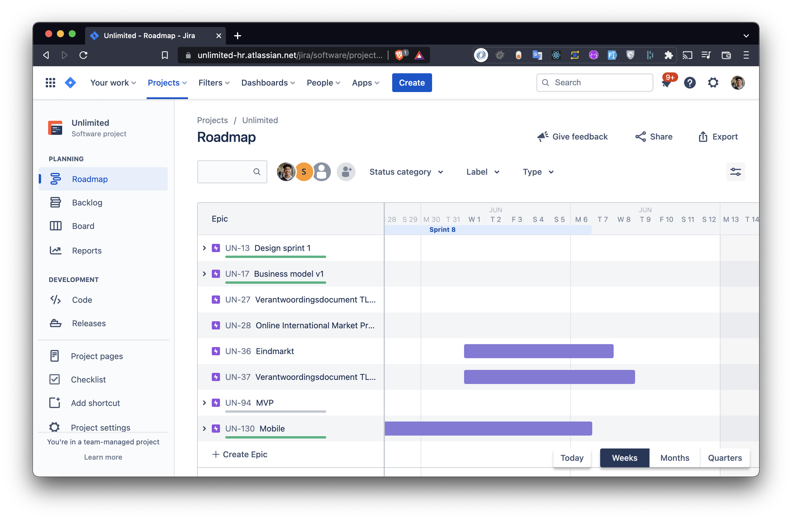
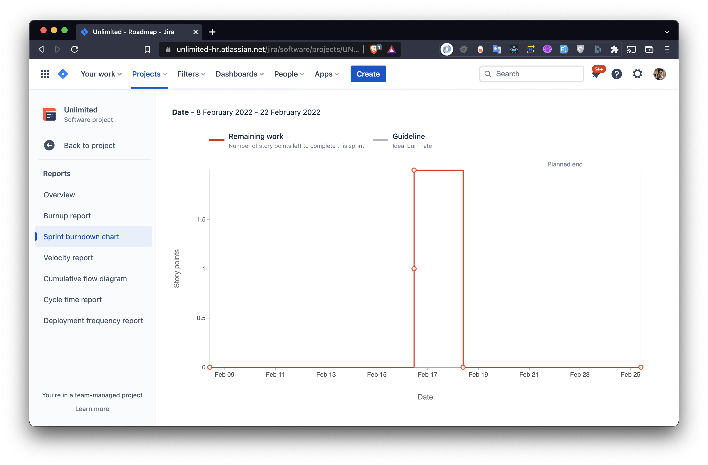

## Situatie
Wij werken met agile scrum methode. En hebben een roadmap gemaakt om alle deadlines in kaart te brengen.
Dat hebben wij in Jira bijgehouden en met elke stand up besproken.

## Taak
Als team is het onze verantwoordelijkheid dat wij alle deadlines halen.
Wij moeten op een manier onze deadlines inzichtelijk houden en het voortgang van het project bewaken.

## Actie
Wij hebben eerder de keuze gemaakt om te gaan werken in Agile-scum.
In Jira hebben wij een road map gemaakt en zogenaamde 'epics' aangemaakt per deadline.

Daarnaast hebben wij de keuze gemaakt om in Jira te werken, zodat wij gebruik konden maken van een automatisch genereerde burndown chart.
Dit geeft ons een overzicht van onze voortgang. Die wij elke vrijdag hebben besproken tijdens de stand-up.

## Resultaat

## Reflectie
Het gebruik maken van story-points is niet altijd gedaan, waardoor de burn-down chart niet altijd even up-to date was.
Het heeft ons wel geholpen.
