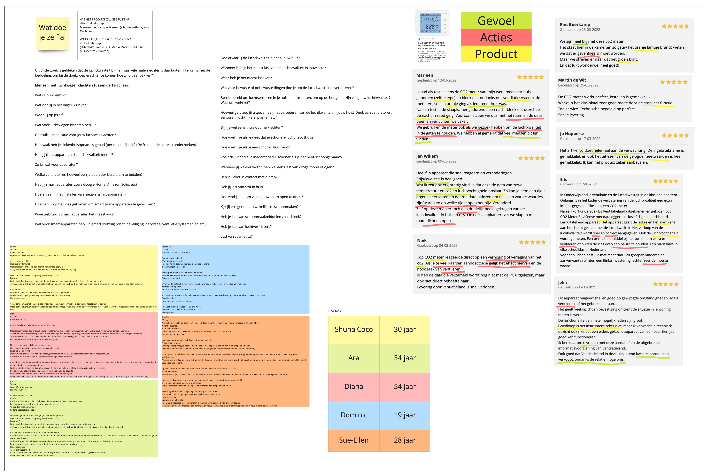
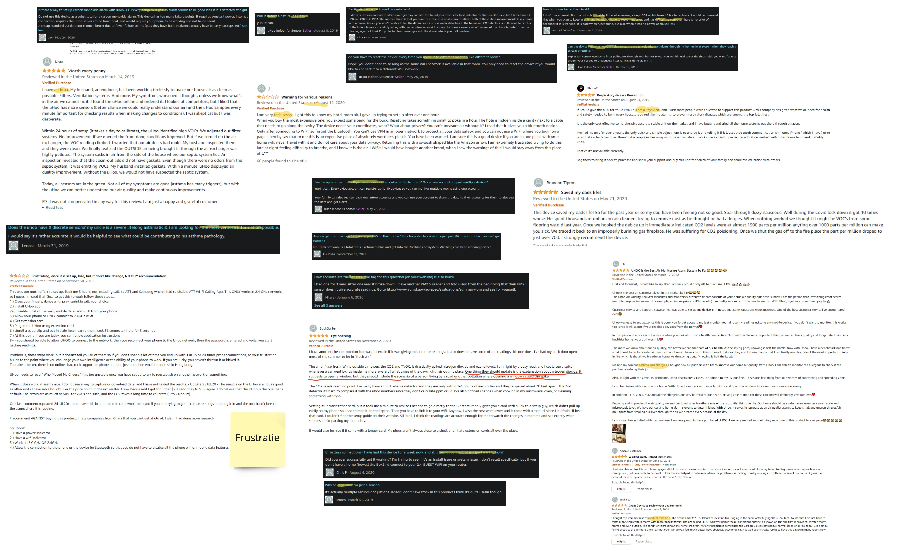
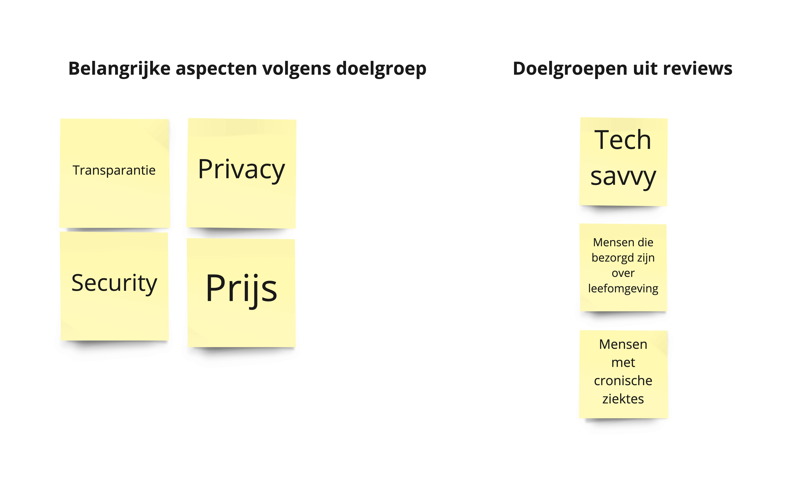
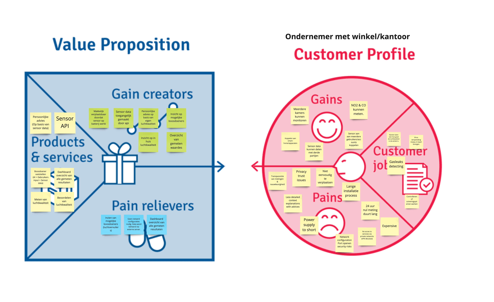
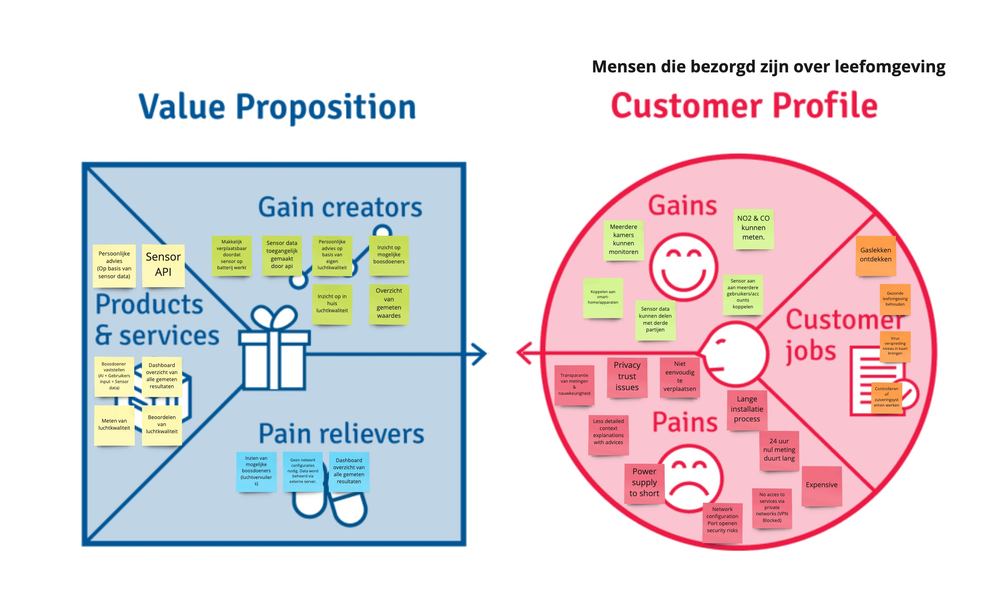

## Situatie
In de eerste periode van TLE hebben wij meerdere iteraties gedaan op onze waarde propositie.
Dit komt door de wijzigingen in het concept en de inzichten uit de interviews.

## Taak
Uit de feedback van retrospectives hebben wij het advies gekregen om de doelgroep concreet vast te stellen.
En een nieuwe doelgroep betekend; Een nieuwe waardepropositie. Het is nou tijd om een definitieve waardepropositie te maken
om verder te gaan met het businessmodel achter het concept.

- Vaststellen van de doelgroep
- Jobs to be done valideren
- Definitieve waardepropositie maken

## Actie
Wij hebben onze aannames gevalideerd met doelgroep interviews en online research.

### Interview research

Wij hebben interviews gedaan met personen uit onze doelgroep.
Met vijf personen hebben wij interviews afgelegd en deze inzichten gebruikt om aannames in onze propositie
te valideren.

Zie afbeelding hier onder of open in [nieuw tabblad](./images/onderzoek-interview-resultaten.jpeg)

### Concurrentie reviews
In de reviews van concurrerende producten hebben wij inzichten op gedaan.
Uit de inzichten hebben wij een interessante job to be done gevonden. Binnen ons doelgroep is er een segment die geïntreseerd is in het achterhalen van de oorzaken
van een slechte luchtkwaliteit. Daarnaast is er ook een groep die specifiek geïnteresseerd is in het meten van stikstofdioxide (NO2).
Wij hebben bij concurrenten reviews gekeken om te kijken waar onze doelgroep naar op zoek is.
Dit hebben wij gedaan om in te spelen op de mogelijke kansen.

Zie afbeelding hier onder of open in [nieuw tabblad](./images/business-model-deskresearch.jpeg)

### Inzichten uit onderzoek
Wij hebben de belangrijkste aspecten voor de doelgroep vastgesteld.
Het bleek dat de doelgroep veel waarde hecht aan transparantie en beveiliging van data verwerking.
Wij hebben om die redenen meer aandacht besteed aan hoe wij de gegevens van de gebruikers verwerken.

### Propositie voor kantoor/ondernemers
Uit onderzoek van TLE 3 bleek dat werkgevers met kantoorpanden ook bezig zijn met waarborgen van luchtkwaliteit,
omdat het te maken heeft met veilige werkomgeving. In het begin van TLE 4 zaten wij nog te twijfelen tussen ondernemers of mensen die bezorgd zijn over in huis luchtkwaliteit.

## Resultaat
Hier onder is onze definitieve waarde propositie onder te vinden.
De doelgroep is mensen die bezorgd zijn over hun leefomgeving.
Deze keuze hebben wij gemaakt omdat uit eerder onderzoek het bleek dat de meerderheid van de bevolking 80% van hun leven thuis door brengt.

### Definitieve waardepropositie

**Wat is de job to be done voor de doelgroep?**

## Reflectie

### Doelgroep onderzoek
Over de loop van TLE 4 hebben wij veel onderzoek ingehaald die wij liever hadden afgerond in TLE 3.
Wij zijn tevreden met de inzichten die wij hebben opgedaan, door de inzichten hebben wij concreter kunnen brainstormen
over belangrijke aspecten voor de doelgroep. Wegens tijdsnood hebben wij niet meer personen kunnen interviewen en dat
moeten wij volgende keer veel ruimer inplannen.

### Experts benaderen
Daarnaast hebben wij het intern ook gehad over meer experts benaderen buiten ons netwerk.
Wij zijn er van overtuigd dat het meer waarde kan crëeren voor ons concept en doelgroep.

### Inzichten meer visualiseren
Wij hebben nu gebruik gemaakt van een value proposition. Dat heeft ons inzicht gegeven of ons product/diensten aansluiten op de doelgroep,
maar in het vervolg zou een customer journey een goede aanvulling zijn.
Zo hebben wij ook een beter beeld over het proces van de job to be done en waar er mogelijke kansen liggen.

